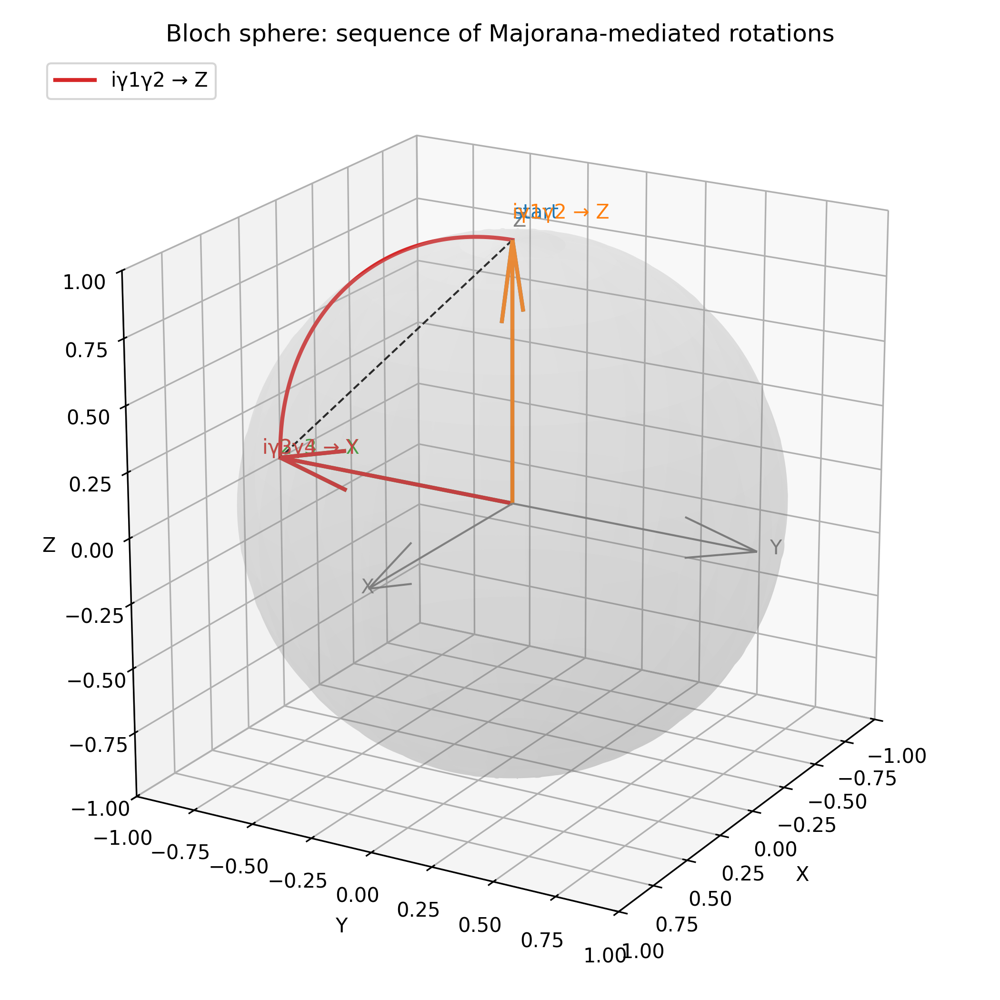

### manipulate Majorana Zero Mode

#### Content

1. Majorana Zero Mode
3. Braid Group described through Quaternion


#### Ref

```
[1]A Short Introduction to Topological Quantum Computation
[2]A Short Introduction to Fibonacci Anyon Models
[3]VISUAL DIFFERENTIAL GEOMETRY and FORMS
[4]A QUATERNIONIC BRAID REPRESENTATION (AFTER GOLDSCHMIDT AND JONES)
```


#### 1.Majorana Zero Mode

在上次的对anyons以及辨群概念入门后，未解决的问题之一是anyons应该以怎么的方式被表达出来以供使用。在[1]文献的阅读后，了解了以下两个方面:

​	1.如何编码Qubit

​	2.Majorana Zero Modes, Berry Phase和Ising Model的关系


##### (1) 

###### 融合树

基于融合规则，可以写出以下形式：

Anyons Model: $M={1,a,b,c}$ , 融合规则 $a\times b = \sum_{c\in M}N_{ab}^{c}c$, 定义标准正交基： $ \left \langle ab;c  |ab;d\right \rangle = \delta_{cd}$ ,可以将其画成融合树

在之前的入门中也构建了辨群，之后构建了F矩阵和R矩阵用来做基变换和旋转操作[2]: 


更全面的例子[2]：


###### 用任意子的融合空间编码量子比特

例子：

2N个Ising Anyons, 融合空间维度$2^{N-1}$,  这里6和$\sigma$编码了2个量子比特

- `(a,b,c) = (1,1,1)` ↔ `|q1 q2⟩ = |00⟩`
- `(a,b,c) = (ψ,1,ψ)` ↔ `|q1 q2⟩ = |10⟩`
- `(a,b,c) = (1,ψ,ψ)` ↔ `|q1 q2⟩ = |01⟩`
- `(a,b,c) = (ψ,ψ,1)` ↔ `|q1 q2⟩ = |11⟩`

原文的图更直观一点[1]


下一步可以构建各种需要的量子门，之前的入门里是先看了这一部分，这里不再赘述


##### (2) 

###### Berry Phase

首先先从Berry相切入， 定义如下：
$$
\left | \Psi_n(z_1,...z_N)   \right \rangle \Rightarrow \sum_{m=1}^{D} \Gamma(\lambda)_{nm} \left | \Psi_m(z_1,...z_N)   \right \rangle
$$

$$
\Gamma(\lambda)= P*exp\oint_{\lambda}A \cdot dz
$$


联络[3]:
$$
(A^j)_{mn} =  \left \langle \Psi_m(z_1,...,z_N) \right | \frac{\partial }{\partial z_j}\left | \Psi_n(z_1,...z_N)   \right \rangle
$$
P :path ordering


Berry Phase 表示了波函数在参数空间的多值性，最后的Berry相则是可以由辨群构建出来的F,R矩阵表示


###### Majorana

一维晶格：
$$
H=\sum_{j=1}^{L}\left[-t\left(f_j^\dagger f_{j+1}+f_{j+1}^\dagger f_j\right)-\mu\left(f_j^\dagger f_j-\tfrac{1}{2}\right)+\left(\Delta_p f_j f_{j+1}+\Delta_p^{*} f_{j+1}^\dagger f_j^\dagger\right)\right].
$$

$$
f_j=e^{-i\theta /2}(\gamma_{2j-1}+i\gamma_{2j})/2 \Rightarrow   (图a)
$$

$$
H=\frac{i}{2}\sum_{j=1}^{L}(-\mu\gamma_{2j-1}\gamma_{2j}+(t+|\Delta_p|)\gamma_{2j}\gamma_{2j+1}+(-t+|\Delta_p|)\gamma_{2j-1}\gamma_{2j+2})
$$


取极限为 化学势或者动力学项远大于对方，得到两种不同的态，拓扑态和平凡态(图b)。


这里，导线的基态是费⽶⼦库珀对的凝聚态，⽽基本激发态是通过消耗能量$2\Delta$将库珀对打破⽽得到的费⽶⼦.

记这里离域的费米子:
$$
d=\frac{\gamma_L + i\gamma_R}{2},\qquad d^\dagger=\frac{\gamma_L - i\gamma_R}{2}
$$
，左右两端是L和R ,有:
$$
\{d,d^\dagger\}=1,\qquad d^2=(d^\dagger)^2=0.
$$
占有数算符$n_d$：
$$
n_d^2=(d^\dagger d)(d^\dagger d)=d^\dagger(1-d d^\dagger)d=d^\dagger d=n_d
$$
因此 \(n_d\) 是投影算符，其本征值只能为 0 或 1，说明该离域费米子模式要么为空，要么被占据一个费米子。

或者用majorana表达： 
$$
n_d=\frac{1+i\gamma_L\gamma_R}{2}
$$
由于算符 \(i\gamma_L\gamma_R\) 是厄米且满足 \((i\gamma_L\gamma_R)^2=1\)，其本征值仅为 \(\pm1\)，代入后得到 \(n_d=(1\pm1)/2\in\{0,1\}\)。


Kitaev 链或文中讨论的极限（例如 \(t=|\Delta_p|\) 且 \(\mu=0\)）下，H可重写成由链内部成对费米子占据项构成的形式，例如
$$
H = 2t\sum_{j=1}^{L-1}\left(\tilde f_j^\dagger\tilde f_j - \tfrac12\right),
$$
此处所有出现的算符都与链两端的 Majorana （\(\gamma_L,\gamma_R\)）不相耦合：两端的 Majorana 被H“解耦”出来，不出现在 H 的项中。故对构成离域费米子的算符 \(d\) 有
$$
[d,H]=0,\qquad [d^\dagger d,H]=0.
$$

物理含义：哈密顿不包含能改变 \(d\) 占据数的项，因此 \(n_d\) 在该模型极限下是守恒量。于是基态分为两类——\(n_d=0\) 與 \(n_d=1\)——它们在能量上简并（若没有其它约束），从而产生拓扑基态的二重简并。


在有限长度链中，左右 Majorana 的波函数重叠，导致离域模不再严格为零能，而是产生能量劈裂 \(\Delta E\)。
$$
\Delta E \propto e^{-L/\xi},
$$
其中 \(L\) 为链长，\(\xi\) 为相干长度（与谱隙成反比）。因此要获得近似零能且拓扑保护良好的离域模，需要保证 \(L\gg\xi\)。

当 `γ1` 与 `γ2` 相距很远时（线长 L ≫ 关联长度 ξ），两态 `|0⟩` 和 `|1⟩` 在能量上近似简并。因此形成拓扑简并空间:

- 局域扰动（仅作用在线的一端或某一局部区域）不能可靠地将 `|0⟩` ↔ `|1⟩`，因为切换占据数需要同时作用在包含 `γ1` 与 `γ2` 的算符或改变整体费米子奇偶性。因此，用 `|0⟩,|1⟩` 编码量子信息时，该信息是“非局域”地分布在线两端，对局域噪声有拓扑鲁棒性（前提是能隙不闭合且总奇偶性受保护）。
- 全局奇偶性守恒是保护编码的关键,对 `2N` 个 Majorana（形成 `N` 个复费米子），未固定总奇偶性时简并度为 `2^N`；若系统总奇偶性保守并被固定，则有效的拓扑简并空间维数为 `2^{N-1}`。编码量子比特通常在这一受保护次空间中实现


主要误差来源与限制：

- Majorana 波函数重叠导致能级劈裂（指数小但非零）。
- 改变全局奇偶性从而破坏保护。
- 局域高能激发或强耦合到外部导致退相干。


###### Majorana Qubit

使用两根导线承载四个⻢约拉纳零模，可以形成一个量子比特：

不固定总奇偶性的情况下，四个 Majorana 给出四维态空间。若固定全局费米子奇偶性（常见实验约束），在偶奇偶子空间中取逻辑基


逻辑 Pauli 可用 Majorana 双算符表示（在固定奇偶子子空间内满足 Pauli 代数），常用选取：

$Z_L=iγ_1γ_2,X_L=iγ_2γ_3,Y_L=iγ_1γ_3.$

**操作**：

交换相邻两个 Majorana:

$U_{23}=exp(\frac{\pi}{4}γ_2γ_3).$

在逻辑子空间，这相当于一个 Clifford 门（即对逻辑 Bloch 球作 π/2型旋转）。多次编织和不同拓扑顺序给出非阿贝尔幺正变换，可实现拓扑受保护的门

通过操控化学势来移动任意⼦是⼀种直接的⽅法。在绝热状态下调整化学势，可以调节拓扑区域的大小，从而进行移动而产生的berry相，和Ising Model是一致的。下面四元数构建出来的在SU(2)下会更直观的体现这一点。


#### 2.Quaternion

 通过四元数，实际上是把辫子问题映射到 SU(2):


##### 从 Majorana 到 Pauli（Jordan–Wigner ）

定义两个费米模：
$$
c_1=\tfrac{1}{2}(\gamma_1+i\gamma_2),\qquad c_2=\tfrac{1}{2}(\gamma_3+i\gamma_4).
$$
采用常用的 Jordan–Wigner 映射（2 个费米子对应 2 qubit）：

- $\gamma_1 = \sigma_x\otimes I$,
- $\gamma_2 = \sigma_y\otimes I$,
- $\gamma_3 = \sigma_z\otimes\sigma_x$,
- $\gamma_4 = \sigma_z\otimes\sigma_y$.

可验证这些 4×4 矩阵满足 Majorana 反交换关系。

##### 辫子生成元

对相邻模定义生成子
$$
M_k = \gamma_k\gamma_{k+1}.
$$
$M_k^2=-I$，且 $M_k^\dagger=-M_k ,\rightarrow$，
$$
e^{(\theta M_k)} = \cos\theta + M_k\sin\theta,
$$
在 $\theta=\pi/4$ 时
$$
e^{\big(\tfrac{\pi}{4}M_k\big)}=\tfrac{1}{\sqrt2}(I+M_k).
$$

用 Pauli 映射可得具体形式（2‑qubit 基）示例：

- $M_1=\gamma_1\gamma_2=(\sigma_x\otimes I)(\sigma_y\otimes I)=\mathrm{i}\,\sigma_z\otimes I$,
- $M_2=\gamma_2\gamma_3=(\sigma_y\otimes I)(\sigma_z\otimes\sigma_x)=\mathrm{i}\,\sigma_x\otimes\sigma_x$,
- $M_3=\gamma_3\gamma_4=(\sigma_z\otimes\sigma_x)(\sigma_z\otimes\sigma_y)=\mathrm{i}\,I\otimes\sigma_z$.

因此每个 $M_k$ 可写成 $M_k = i(\vec{n}_k\cdot\vec{\Sigma})$ 的形式（其中 $\vec{\Sigma}$ 为相应子空间的 Pauli 向量）。

##### 对应 SU(2) 的旋转

记
$$
q_k \equiv \exp\big(\tfrac{\pi}{4}M_k\big)=\exp\!\Big(i\tfrac{\pi}{4}\,\vec{n}_k\cdot\vec{\Sigma}\Big).
$$
这是 SU(2) 的旋转——绕轴 $\vec{n}_k$ 做角度 $\pi/2$（在 Bloch 球约定下），即把交换操作视作 SU(2) 上的轴-角旋转。

若设 $u,v$ 分别对应相邻两个生成子（满足循环/反对易关系），则可用四元数或 Pauli 代数展开：
$$
q_u q_v q_u = q_v q_u q_v.
$$
在矩阵层面把 $M_k$ 代入 4×4 矩阵并直接数值相乘可以验证等式成立。



把 Majorana 交换映射为逻辑 qubit（Bloch 球）上的一系列受控旋转。每一步是把逻辑态向量做一次 SU(2) 旋转。

单次相邻 Majorana 交换算子 $U_j = exp((π/4) γ_jγ_{j+1})$ 在逻辑子空间上等价于$ exp(i(π/4)σ_n)$，在 Bloch 球上把向量绕轴 n 旋转角度 $π/2$


**(注，以下内容是喂给ai询问有没有什么物理上的实际用途的)**

###### 逻辑子空间

- 用 4 个 Majorana 编码一个逻辑 qubit（固定全局奇偶性）。例如定义逻辑 Pauli：
    $$\bar Z = i\gamma_1\gamma_2,\qquad \bar X = i\gamma_2\gamma_3.$$ 
- 把 4×4 的 $q_k$ 限制到固定奇偶性的 2 维子空间，将得到 2×2 的逻辑矩阵（即逻辑 qubit 上的 SU(2) 门）。
- 读出通过测量相应的费米子占据（例如测 $i\gamma_1\gamma_2$）。

###### 从耦合到旋转角

若物理哈密顿为
$$
H(t)=J(t)\,\gamma_i\gamma_{i+1}=J(t)M_k,
$$
则（在无其他非平凡非交换扰动的近似下）演化相当于
$$
U=\mathcal{T}\exp\Big(\int H(t)\,dt\Big)\approx \exp(\theta M_k),\quad \theta=\int J(t)\,dt.
$$
因此实现 $q_k=\exp(\tfrac{\pi}{4}M_k)$ 需要满足
$$
\int J(t)\,dt = \tfrac{\pi}{4}.
$$
脉冲应采用平滑窗（Gaussian/Slepian）以减少非绝热激发，实际还要参照系统能隙给出时间尺度。

###### 误差线性化与鲁棒设计（四元数参数化的优势）

设实际旋转为 $q'=\exp((\tfrac{\pi}{4}+\delta\theta)M')$，其中 $M'=i(\vec{n}+\delta\vec{n})\cdot\vec{\Sigma}$. 小量展开得：
$$
q' \approx q \cdot \exp\big(\delta\theta\,M + \tfrac{\pi}{4}\,i\,\delta\vec{n}\cdot\vec{\Sigma}\big).
$$
在四元数（SU(2)）参数化下，角度与轴误差的影响可直接线性化并评价对保真度 $F$ 的影响（典型 $1-F=O(\delta\theta^2,\|\delta\vec{n}\|^2)$）。这种参数化便与解析设计补偿旋转序列。
