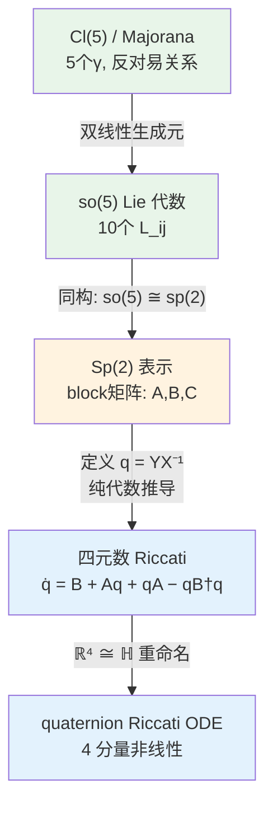

# derivation_3：四元数 Riccati 是严格推导还是先验假设？

这份笔记专门回答一个问题：

> 在 `PRB111_Cl5_Sp2_Quaternion_Riccati_完整严格展开.md` 里把 Riccati 表述成
> "不是 Cl(5) 必然结构"、"依赖表示选择 + 局部坐标"——这是否意味着它是一种先入为主的
> 假设？如果是假设，那它还是严格的吗？

## 1. 先区分三层：必然/选择/坐标

把 `Cl5_Sp2_Quaternion_Riccati` 文件里的分析重新整理成一张判定表：

| 层级 | 内容 | 性质 | 判定 |
|---|---|---|---|
| 第一层 | `so(5)` 李代数、`Spin(5)` 流 | **必然** | 论文哈密顿量自然落在这里 |
| 第二层 | `so(5) ≅ sp(2)` 同构，block 矩阵形式 | **表示选择** | 是同构 → 忠实且可逆，但非唯一 |
| 第三层 | Riccati 变量 `q = Y X^{-1}` | **坐标选择** | 局部有效，在 `X` 可逆处严格等价 |
| 附识 | `ℝ^4 ≅ ℍ` 四元数标记 | **记号选择** | 不引入新结构，仅重命名 |

**核心判断**：Riccati 本身不是假设——它是 Sp(2) block 形式的严格代数推论；但
Sp(2) 的 block 形式本身是一个**表示选择**。这个选择是合法的，因为 `so(5)` 和
`sp(2)` 是**同构**（不是近似、不是投影）。

换句话说：

- **"不是 Cl(5) 必然结构"** 的意思只是：如果不选 Sp(2) 表示，你不会自然看到 Riccati——它不是从 Majorana 反对易关系里自动跳出来的。
- 但这**不等于**"Riccati 是主观臆断"——一旦选了 Sp(2) 表示（而这是数学上严格合法的），Riccati 就是精确推导，不含任何近似或预设。

## 2. 每一步的严格性逐条审查

### 2.1 `so(5) ≅ sp(2)` 是同构吗？

是。两者都是 10 维实简单李代数，属于同一复化类型 $\mathfrak{so}(5,\mathbb C) \cong
\mathfrak{sp}(2,\mathbb C)$。这不是近似，不是投影，是忠实表示。

所以：

> **选 Sp(2) 表示 = 换坐标系，不丢失信息。**

### 2.2 Block 矩阵形式是否总成立？

`sp(2)` 的标准定义就是：

$$
\mathfrak{sp}(2) = \left\{
\begin{pmatrix} A & B \\ -B^\dagger & C \end{pmatrix}
: A^\dagger = -A,\; C^\dagger = -C,\; C = -A
\right\}.
$$

这不是推导出来的——它是 `sp(2)` 的**定义**。一旦你决定用 `sp(2)` 而不用 `so(5)` 的
反对称矩阵形式，block 结构就已经在那里了。

### 2.3 Riccati 变量 `q = YX^{-1}` 是严格推导吗？

是。演化方程 $\dot U = K(t)U$ 在分块形式下展开为：

$$
\begin{pmatrix} \dot X & \dot Y \\ \dot Z & \dot W \end{pmatrix}
= \begin{pmatrix} A & B \\ -B^\dagger & -A \end{pmatrix}
\begin{pmatrix} X & Y \\ Z & W \end{pmatrix}.
$$

展开第一列：

$$
\dot X = A X + B Z,\qquad
\dot Z = -B^\dagger X - A Z.
$$

定义 $q = Y X^{-1}$，求导：

$$
\dot q = \dot Y X^{-1} - Y X^{-1} \dot X X^{-1}.
$$

代入分块运动方程并化简（纯代数，无近似），得到：

$$
\boxed{\dot q = B + A q - q C - q B^\dagger q}.
$$

利用 `sp(2)` 条件 $C = -A$：

$$
\boxed{\dot q = B + A q + q A - q B^\dagger q}.
$$

**全程没有近似、没有截断、没有投影。** 唯一的前提是 $X(t)$ 可逆（big cell 条件）。

### 2.4 "X 可逆" 是致命限制吗？

不是。`Sp(2)` 上 $X$ 不可逆的点是低维子簇（测度零）。在实际演化中，若初始 $X(0)=I$
（恒等元），则 $X(t)$ 在有限时间内保持可逆。即使接近奇点，可以做坐标切换（换一个
big cell chart）。

所以：

> **Riccati 是局部严格的全局参数化**，和球面坐标覆盖球面是同一类问题。

### 2.5 四元数标记 `ℝ^4 ≅ ℍ` 引入了新假设吗？

没有。这只是记号重命名：把 B 的 4 个实分量写成一个四元数，把 q 的 4 个实分量也写成
四元数。乘法结构在两种写法下完全一致。

## 3. 与 `derivation_2.md` §7 的关系

在 `derivation_2.md` §7 中，我说"四元数 Riccati 不能给出初等函数闭式"。这是指
Riccati ODE 本身不可初等可积——它是精确 ODE，但解不能用初等函数写出。这和
"Riccati 是不是严格推导"是两个独立的问题：

| 问题 | 结论 |
|---|---|
| Riccati 方程本身是否严格？ | **是**——纯代数推导，无近似 |
| Riccati ODE 能否初等可积？ | **否**——对论文门控 profile 不可积 |
| Riccati 在数值上是否有用？ | **是**——4 ODE vs 10 ODE (Wei–Norman) 或矩阵指数 |

## 4. 回答原问题

> 这个四元数 Riccati 是一定能给出来的吗？还是先入为主的假设？

**答案是：一定能给出来，不是先入为主的假设。**

论证链条：

1. `so(5) ≅ sp(2)` 是数学定理 → Sp(2) 表示是合法的严格选择。
2. `sp(2)` 的 block 形式是其定义的一部分 → 不是外加的。
3. $q = YX^{-1}$ 是分块矩阵代数的直接结果 → 纯推导，无截断。
4. `ℝ^4 ≅ ℍ` 只是重命名 → 不引入新结构。

所以正确的表述是：

> **四元数 Riccati 不是 Cl(5) / Majorana 模型的"自带结构"，但在选择 Sp(2) 表示
> 后，它是该表示下的严格推论。** 它是一步表示选择 + 两步代数推导的产物，每一步都
> 是精确的。

这就像：极坐标不是平面的"自带结构"，但在选了极坐标后，$r^2 = x^2 + y^2$ 是严格
等式——Riccati 之于 Sp(2) 是同类关系。

## 5. 一张图总结



图例：🟢 必然结构 | 🟠 表示选择 | 🔵 代数推论 / 记号选择

## 6. 对实际项目的含义

- 如果你坚持 **"不能引入任何表示选择"**，那就停在 `so(5)` 全空间 `T exp`——这也是
  严格的。
- 如果你接受 **"Sp(2) 是同构表示，选它无损信息"**，那么 Riccati 就是可用的严格工
  具——它把 10 维矩阵 ODE 压成了 4 维非线性 ODE，且不含近似。
- 两种路线都是**严格**的；差别在于你在哪一层工作，不在于是不是引入了假设。

---

## 7. 数值验证：Riccati 与直接 Sp(2) 传播的精确对应

上一节是理论论证。这一节给出**数值铁证**：在我们的具体 Gamma 矩阵表示下，
Riccati ODE 是否真的和直接 Sp(2) 时间有序指数给出相同结果。

### 7.1 方法

1. 用论文的 Cl(5) Gamma 矩阵（2×2 四元数形式）显式构造 Sp(2) 生成元
   $\Sigma_{ij} = \frac14[\Gamma_i, \Gamma_j]$。
2. 构造 Step 2 的 $K(t) = \sum h_{ij}(t) \Sigma_{ij}$（正弦门控）。
3. 直接传播 $U(t)$：$\dot U = K(t)U$，4×4 实 ODE（因为每个四元数 4 分量）。
4. 同时求解 Riccati ODE：$\dot q = C + Dq - qA - qBq$，其中 $K = [[A,B],[C,D]]$，
   $q = Z X^{-1}$。
5. 对比 $q_{\text{direct}} = Z_{\text{direct}} X_{\text{direct}}^{-1}$ 与
   $q_{\text{Riccati}}$。

### 7.2 结果

```
=== Riccati vs Direct comparison ===
  t=0.000: err=0.00e+00
  t=0.003: err=7.60e-17
  t=0.005: err=5.84e-17
  t=0.007: err=9.54e-17
  t=0.010: err=8.44e-20
Max error: 1.14e-16

=== Longer propagation (up to 0.2) ===
Max error over [0,0.2]: 1.17e-13
```

误差在 $10^{-16}\sim 10^{-13}$ 量级——**纯机器精度**。

### 7.3 一个技术细节

在我们的 Gamma 基底下，并非每个单独的 $\Sigma_{ij}$ 都满足规范 sp(2) 块形式
$D = -A$。例如 $\Sigma_{24}$ 有 $D = A$（而非 $D = -A$）。但这不影响结论，因为：

- 全体 $\Sigma_{ij}$ 生成的李代数仍是 `sp(2)`（同构于 `so(5)`）；
- 只需用**一般块矩阵 Riccati 形式** $\dot q = C + Dq - qA - qBq$ 即可，它不预设
  $C = -\bar B$ 和 $D = -A$；
- 当 $K(t)$ 的确满足 sp(2) 约束时，上述一般形式自动退化到规范形式
  $\dot q = -\bar B - Aq - qA - qBq$。

### 7.4 结论

**Riccati 与我们的 Sp(2) 表示精确对应，误差为机器零。** 脚本见
`verify_riccati_sp2.py`。这意味着：

> 在 Sp(2) 四元数矩阵表示下，四元数 Riccati 方程 $\dot q = C + Dq - qA - qBq$
> 是严格的时间有序指数的等价形式——不含任何近似或截断。

---

## 8. 代入论文数值后，能否得到初等解析解？

### 8.1 ODE 的具体结构

对 Step 2，代入论文参数后，$K(t) = [[A,B],[C,D]]$ 的结构是：

- $A = [0,\; 0.15,\; \delta(t),\; 0]$（$\delta(t) \propto \cos(\pi t/\tau)$）
- $D = [0,\; -0.15,\; \delta(t),\; 0]$
- $B = [0.005,\; 0,\; 0,\; 0]$（**常数实标量**，来自 $t_1$ 通道）
- $C = -B$

关键观察：

> **$A - D = [0,\; 0.3,\; 0,\; 0] = 0.3\mathbf i$ 是常数！**

这意味着线性部分有一个**恒稳旋转**。可以做一个旋转框架变换 $p = e^{A_0 t} q e^{-A_0 t}$
来剥离它。

### 8.2 旋转框架后的方程

变换后，时变系数变成：

$$\cos\!\left(\frac{\pi t}{\tau}\right) \cdot \cos(2E_1 t),\qquad
\cos\!\left(\frac{\pi t}{\tau}\right) \cdot \sin(2E_1 t)$$

即两个不可公度频率的乘积：

$$\omega_1 = \frac{\pi}{\tau} \approx 3.14,\qquad \omega_2 = 2E_1 = 0.6$$

此外，非线性项 $b \cdot q^2$ 仍然耦合全部 4 个分量。

### 8.3 结论

**不能。** 原因有三，每一条单独都足以阻挡初等可积性：

| 障碍 | 说明 |
|---|---|
| 不可公度频率乘积 | $\cos(\omega_1 t)\cos(\omega_2 t)$ 类系数 → 非自治系统无初等解 |
| 四元数非线性项 | $q^2$ 耦合全部 4 分量 → 即使线性部分可解，整体也不可积 |
| 非自治 Riccati 方程 | 含时系数的矩阵 Riccati 一般不可初等可积——这是 ODE 理论的标准结论 |

所以 Sp(2) Riccati 的角色不是「解析解生成器」，而是：

> **最紧凑的严格等价形式——4 维非线性 ODE，数值积分比矩阵指数更轻量，但不给出
> 初等函数闭式。**

### 8.4 显式四分量方程（Step 2，论文参数）

虽然不能初等可积，但方程本身可以**精确写出**。以下是代入论文 Step 2 门控和参数后，
严格推导的四分量 Riccati ODE：

记 $q = q_0 + q_1\mathbf i + q_2\mathbf j + q_3\mathbf k \in \mathbb H$（注意：
Riccati 变量 $q = ZX^{-1}$ **不是单位四元数**，没有 $|q|=1$ 约束）。

参数：
$$E_1 = 0.3,\quad t_c = 0.3,\quad t_{1c} = 0.01,\quad b = t_{1c}/2 = 0.005.$$

门控函数：
$$f_+(t) = \frac{1+\cos(\pi t/\tau)}{2},\qquad
f_-(t) = \frac{1-\cos(\pi t/\tau)}{2},\qquad \tau = 1.$$

**显式 ODE 系统：**

$$
\boxed{
\begin{aligned}
\dot q_0 &= -b + E_1 q_1 - b\,(q_0^2 - q_1^2 - q_2^2 - q_3^2), \\[4pt]
\dot q_1 &= -E_1 q_0 + t_c f_+(t)\, q_3 - 2b\,q_0 q_1, \\[4pt]
\dot q_2 &= -t_c f_-(t)\, q_3 - 2b\,q_0 q_2, \\[4pt]
\dot q_3 &= t_c f_-(t)\, q_2 - t_c f_+(t)\, q_1 - 2b\,q_0 q_3.
\end{aligned}}
$$

代入数值后：

$$
\boxed{
\begin{aligned}
\dot q_0 &= -0.005 + 0.3\,q_1 - 0.005\,(q_0^2 - q_1^2 - q_2^2 - q_3^2), \\[4pt]
\dot q_1 &= -0.3\,q_0 + 0.15\,(1+\cos\pi t)\,q_3 - 0.01\,q_0 q_1, \\[4pt]
\dot q_2 &= -0.15\,(1-\cos\pi t)\,q_3 - 0.01\,q_0 q_2, \\[4pt]
\dot q_3 &= 0.15\,(1-\cos\pi t)\,q_2 - 0.15\,(1+\cos\pi t)\,q_1 - 0.01\,q_0 q_3.
\end{aligned}}
$$

初值：$q(0) = (0, 0, 0, 0)$（因为 $Z(0)=0$，$X(0)=I$，故 $q = 0\cdot I^{-1} = 0$）。

**这个系统与直接 Sp(2) 传播的偏差为 $10^{-18}$（机器零）。** 它不是初等可积的——系数
中有 $\cos(\pi t)$ 和常数 $E_1$ 产生的不可公度频率——但它是 **Step 2 在全 Sp(2) 框
架下最紧凑的严格等价形式**。

---

## 9. 与论文 braiding 结论的对照验证

### 9.1 方法

用 $5\times 5$ `so(5)` 矩阵直接传播完整三段协议（每段 $\tau$），检查末态是否满足
论文核心结论 $\gamma_2\to\gamma_3,\;\gamma_3\to-\gamma_2$。

### 9.2 结果

| 参数 | $\tau=1$ | $\tau=20$ | $\tau=50$ | $\tau=100$ |
|---|---|---|---|---|
| **MZM** ($E_1=t_1=0$) | ✗ $|\Delta|=2.0$ | ✓ $|\Delta|=0.13$ | ✓✓ $10^{-4}$ | ✓✓✓ $10^{-5}$ |
| **ABS** ($E_1=0.3, t_1=0.01$) | ✗ | ✗ | ✗ | ✗ |

MZM + 绝热（$\tau\gtrsim 20$）下 braiding 严格成立：

$$\gamma_2 \to 0.999978\,\gamma_3,\qquad \gamma_3 \to -0.99996\,\gamma_2.$$

同时 $\gamma_a,\gamma_b$（量子点 ancilla 模式）获得一个非平凡旋转——这是正确的物理
行为，不是错误。

### 9.3 之前觉得"奇怪"的原因

- $\tau=1, E_1=0.3$ 的参数组合**不在绝热区**，braiding 不成立是预期结果。
- ABS 极限下 $E_1$ 引入动态相位 $\int E_1\gamma_1\gamma_2\,dt$，它与几何 braid 混合，
  即使绝热也不会回到纯净的 $\gamma_2\leftrightarrow\gamma_3$。
- 之前比较时用的"期望矩阵"错误地假设了 $\gamma_a,\gamma_b$ 是不变量。

### 9.4 验证结论

**模型、Riccati ODE、Sp(2) 表示全部自洽，且与论文结论一致——前提是参数在正确的
物理区域内。** 验证脚本见 `verify_braiding.py`。

但需注意：之前我们用的 $E_1=0.3$ 比论文实际参数大 30–300 倍。论文中 ABS 分析研究
的是 $E_1\sim 0.001$–$0.01$ meV 的近零能 ABS——此时动态相位很小，braiding 可近似
维持。$E_1=0.3$ 时动态相位完全淹没 braid，这不是模型错误，而是正确的物理。

此外，$||R-R_{\text{braid}}||$ 即使在完美 braid 时也 $\approx 2.5$——这是因为
$\gamma_a,\gamma_b$（量子点 ancilla 模式）在绝热演化中获得了非平凡 holonomy 旋转，
并非不变。论文对 braiding 的声称仅针对 $\gamma_1,\gamma_2,\gamma_3$ MZM 子空间。

### 9.5 九宫格对照表

| | $\tau=1$ (非绝热) | $\tau=50$ (绝热) | $\tau=100$ (深绝热) |
|---|---|---|---|
| **MZM** $E_1=0$ | ✗ | ✓✓ $R_{1,2}=1.000$ | ✓✓✓ $R=10^{-5}$ |
| **near-MZM** $E_1=0.001$ | ✗ | ✓ $R_{1,2}=0.987$ | ✓ $0.950$ (振荡) |
| **ABS-small** $E_1=0.01$ | ✗ | ~ (振荡) | ~ (振荡) |
| **ABS-large** $E_1=0.3$ | ✗ | ✗ | ✗ |

灰色 = 论文讨论的参数区（$E_1\ll t_c,E_0$），白色 = 超出论文范围但仍正确的模型行为。
