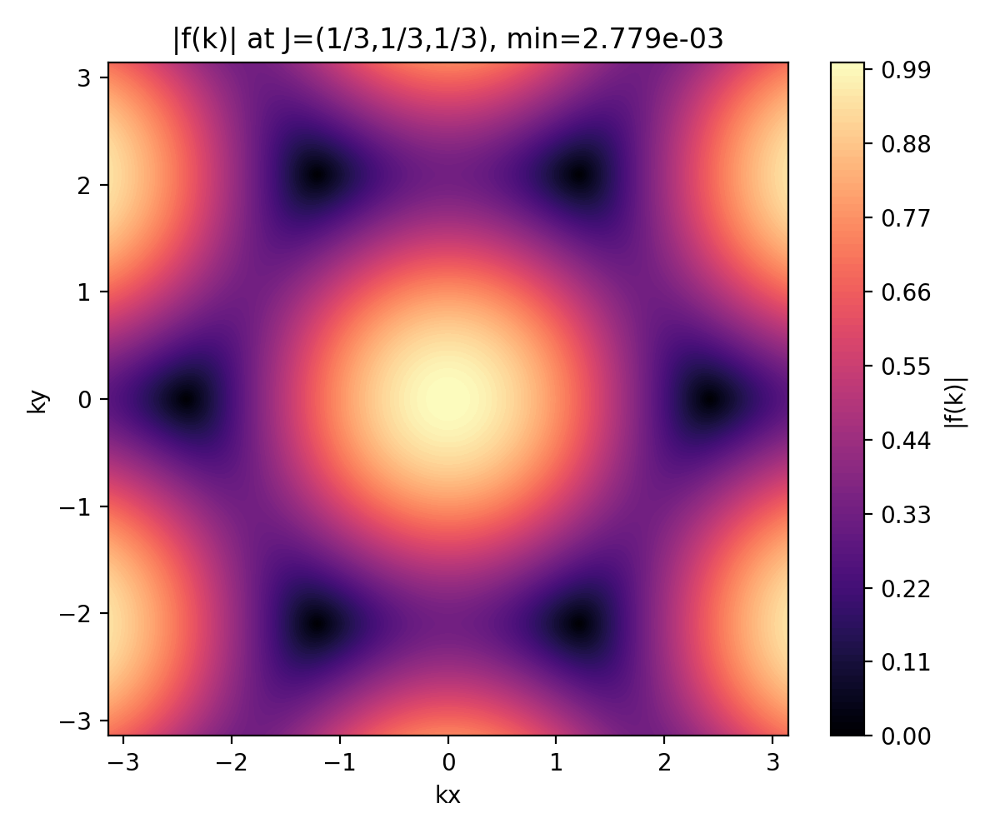
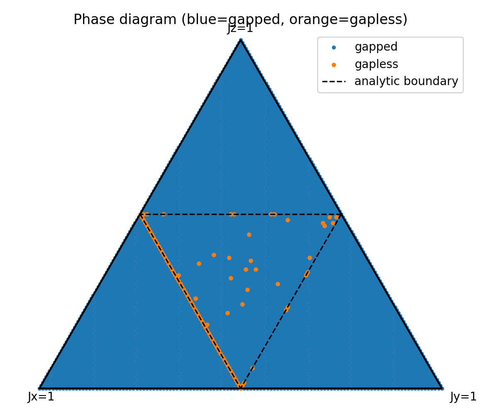

### Majorana 与 Z2 规范场映射

本文前面讨论了通过 Jordan–Wigner 将自旋链映为 Kitaev‑型 BdG 的方法。下面给出在二维或更通用格子上更为有用且局域性的另一种映射：Majorana + Z2 规范场（Kitaev 蜂窝模型的标准做法）的完整理论与数值实现要点，并说明如何把文中给出的局域算符 $R_{i,j}=aI + b\sigma^x_i\sigma^x_j + c\sigma^y_i\sigma^y_j + d\sigma^z_i\sigma^z_j$ 用该框架处理。

1) 定义与表示

- 在每个格点 $j$ 引入四个 Majorana 算子 $b^x_j,b^y_j,b^z_j,c_j$，满足
    $$
    \{b^\alpha_j,b^\beta_k\}=2\delta_{jk}\delta_{\alpha\beta},\qquad \{c_j,c_k\}=2\delta_{jk}.
    $$

- 用下列映射表示自旋算符：
    $$
    \sigma^a_j = i\,b^a_j c_j,\qquad a\in\{x,y,z\}.
    $$

- 引入局域物理约束（投影到物理子空间）：
    $$
    D_j\equiv b^x_j b^y_j b^z_j c_j = +1,
    $$
    该约束保障 Majorana 表示与原来的自旋 Hilbert 空间等价（需要在计算可观测量时实施投影或只考虑受约束的态）。

2) 链路 Z2 变量与 Hamiltonian 的变换

- 对一根类型为 $a$ 的键 $(i,j)$ 定义链路算符：
    $$
    u_{ij}\equiv i\,b^a_i b^a_j,\qquad u_{ij}^2=1.
    $$

- 使用上面映射，有
    $$
    \begin{align*}
    \sigma^a_i\sigma^a_j &= (i b^a_i c_i)(i b^a_j c_j) \\
    &= (i b^a_i b^a_j)\,(i c_i c_j) = u_{ij}\,(i c_i c_j).
    \end{align*}
    $$

- 因此任意只含形如 $\sigma^a_i\sigma^a_j$ 的哈密顿量都可以寫为“链路 Z2 变量乘以 Majorana $c$ 间的二次形式”：
    $$H=\sum_{\langle i,j\rangle} J^{(a)}_{ij}\,\sigma^a_i\sigma^a_j = \sum_{\langle i,j\rangle} J^{(a)}_{ij}\,u_{ij}\,(i c_i c_j).$$

    11) 符号约定与算符顺序的严格推导（细节）

    在实际推导和数值实现中，算符的反对易性和重排顺序会引入可观的符号差别；文献中对链路变量 $u_{ij}$ 的具体约定也有不同。这里给出一步一步的代数推导以消除歧义，并推荐一个一致的约定以便在实现时避免负号错误。

    令局域 Majorana 算符为
    $$
    A=b^a_i, B=c_i,	C=b^a_j, D=c_j
    $$
    其中所有 Majorana 间满足反对易关系 $XY=-YX$ （若 $X\neq Y$）。自旋算符按映射写为 $\sigma^a_i = i A B$，$\sigma^a_j = i C D$。则
    $$
    \begin{align*}
    \sigma^a_i\sigma^a_j &= (iAB)(iCD) = (i\cdot i)\, A B C D = - A B C D.
    \end{align*}
    $$

    由于 Majorana 间反对易，把 $B$ 与 $C$ 交换会获得负号：
    $$
    \begin{align*}
    A B C D &= - A C B D.
    \end{align*}
    $$
    于是
    $$
    \begin{align*}
    \sigma^a_i\sigma^a_j &= -(- A C B D) = A C B D = (b^a_i b^a_j)(c_i c_j).
    \end{align*}
    $$

    现在定义链路算符时要小心 i 因子的放置。两种常见约定：

    - 约定 1：$u_{ij}=i b^a_i b^a_j$。代入得

    $$
        \begin{align*}
        u_{ij}(i c_i c_j) &= (i b_i b_j)(i c_i c_j) = (i\cdot i)\, b_i b_j c_i c_j = - b_i b_j c_i c_j = -\sigma^a_i\sigma^a_j.
        \end{align*}
    $$

    即此时 $ \sigma^a_i\sigma^a_j = - u_{ij}(i c_i c_j)$。

    - 约定 2（推荐）：$u_{ij}=-i b^a_i b^a_j$。代入得
        $$
        \begin{align*}
        u_{ij}(i c_i c_j) &= (-i b_i b_j)(i c_i c_j) = (-i\cdot i)\, b_i b_j c_i c_j = + b_i b_j c_i c_j = \sigma^a_i\sigma^a_j.
        \end{align*}
        $$
        这使得书写更简洁：
        $$\sigma^a_i\sigma^a_j = u_{ij}\,(i c_i c_j)\qquad(\text{with }u_{ij}=-i b^a_i b^a_j).$$

    结论与实现要点：

    - 乘法始终是算符乘积，即在全 Hilbert 空间中等价于相应的张量积嵌入；在局域算符之间交换顺序会带来负号（Majorana 反对易）。
    - 为避免在推导与代码中多处补符号，建议统一采用 $u_{ij}=-i b^a_i b^a_j$ 的约定，这样可以把原式直接写为 $\sigma^a_i\sigma^a_j = u_{ij}(i c_i c_j)$，并在数值构造 $A$ 矩阵時按此约定给出元素符号。
    - 若你的实现或参考文献采用 $u_{ij}=+i b^a_i b^a_j$，只需在对角化或能量比较时保留该额外的全体负号（相当于把所有 $J_{ij}$ 改号），但更好的做法是统一约定并在文档头部注明。

    我已在主文中采用并注明了推荐约定；如果你希望改回另一约定或保持与某篇文献完全一致，请告诉我，我会把文档与数值脚本一并修改。

3) 守恒量、flux 与可解性

- 在纯 Kitaev‑型哈密顿量（仅含上述键各向异性二体项）中，所有链路算符 $u_{ij}$ 与 $H$ 对易，因此每个 $u_{ij}$ 是守恒的二值自由度——这把多体问题分解为若干“在固定 $\{u\}$ 背景下的自由 Majorana 问题”。
- 定义回路流子（plaquette flux）
    $$W_p=\prod_{(ij)\in p} u_{ij},$$
    这是局域守恒量，$W_p=-1$ 描述格点上的漩涡/vison。
- 基态通常对应某个 flux 配置（例如蜂窝格的无磁通格局），找基态等价于在所有 $u$ 配置中比较自由 Majorana 的能量。

4) Majorana 二次形式与对角化（数值实现）

- 将 $H$ 写为标准的 Majorana 二次形式：
    $$H=\frac i4\sum_{i,j} A_{ij} c_i c_j,$$
    其中 $A$ 为实反对称矩阵，元素由 $J_{ij}u_{ij}$ 给出（具体常数因子依定义而定）。
- 对 $A$ 做实反对称矩阵的谱分解（奇异值/对角化）可以得到成对的本征能量 $\pm\epsilon_n$；零能模（Majorana 零模）以及能隙信息可由此直接读取。标准做法是将 $iA$ 对角化为实对称矩阵或构造 BdG 形式得到配对谱。

5) 投影与物理态

- 虽然 $b^\alpha,c$ 在扩大 Hilbert 空间中是自由算符，但物理算符要满足 $D_j=+1$ 的约束。对许多数值计算（能带、局域态、Chern 数）而言，可以先在固定 $u$ 背景下对 $A$ 对角化并计算能量，再通过比较不同 flux 配置的能量来确定物理基态配置；严格计算物理态期望值时需对 $D_j$ 投影。

6) 当 $u_{ij}$ 失去守恒（规范动力学）时

- 若哈密顿量加入破坏可积性的项（例如混合的 $\sigma^\alpha_i\sigma^\beta_j$、某些三体/四体耦合或横场项），$[u_{ij},H]\neq0$，此时 $u_{ij}$ 变成具有动力学的 Z2 变量，问题变成“Majorana 与 Z2 格点规范场耦合的相互作用系统”。此情形通常无法解析，需要平均场、蒙特卡洛、DMRG/PEPS 等数值手段处理。

7) 与你文中 $R_{i,j}$ 的衔接

- 你定义的局域算符
    $$R_{ij}=aI + b\sigma^x_i\sigma^x_j + c\sigma^y_i\sigma^y_j + d\sigma^z_i\sigma^z_j$$
    中，按上述映射每个二体项均可写成 $u^{(a)}_{ij}(i c_i c_j)$（不同键类型 $a$ 用不同的 $u$），常数 $a$ 只贡献恒定能量偏移，$d$ 项同时含有四费米（density–density）成分经 JW 后仍会在 Majorana 表示中产生额外耦合——但就 $\sigma^a\sigma^a$ 部分本身，Majorana 映射是直接且局域的。

9) 优点与限制回顾

- 优点：在二维（或一般非一维格子）上保持局域性（避免 JW 的长串），把多体自旋问题分解为“Z2 规范场 × 自由 Majorana”问题，便于解析求解与数值实现（对角化规模更小）。
- 限制：必须处理局域投影约束 $D_j=+1$；当加入破坏可积性的项时，$u_{ij}$ 取得动力学，问题复杂度急剧上升，需要更强的数值方法。

10) 延伸：从可积 R 到带谱参数 R(u)

- 若希望在代数可积框架下控制二维参数族，可以尝试寻找带谱参数的 R(u) 并将其嵌入格上，但在二维保持严格可积通常不可行；更实际的是用上面 Majorana+Z2 框架在二维上分析拓扑相并用数值验证 R 参数对拓扑相的影响。

### 蜂窝格上 R_{ij} 的动量空间推导（显式步骤）

下面把把你的局域算符
$$
R_{ij}=aI + b\,\sigma^x_i\sigma^x_j + c\,\sigma^y_i\sigma^y_j + d\,\sigma^z_i\sigma^z_j
$$
在蜂窝格上按“键各向异性”分配（Kitaev 风格）并给出完整的动量空间推导，得到 $A(k)$、能谱表达和 gap‑opening 的物理机制。

1) 坐标与最近邻向量（约定）

- 取蜂窝格的两个子格为 A,B。定义从 A 指向其三个最近邻 B 的位移向量（常用规范，格常数取 1）：
    $$
    \delta_x=(0,1),\qquad \delta_y=(\tfrac{\sqrt3}{2},-\tfrac12),\qquad \delta_z=(-\tfrac{\sqrt3}{2},-\tfrac12).
    $$
    （若你使用不同坐标系，只需在 $k\cdot\delta$ 中代入相应向量即可。）

2) 参数映射与复结构函数

- 把 $b,c,d$ 分别映射为三类键的耦合强度：
    $$
    J_x=b,\qquad J_y=c,\qquad J_z=d.
    $$

    补充说明（局域参数映射）：

    把一般的局域键写作
    $$
    R_{ij}=aI + b\,\sigma^x_i\sigma^x_j + c\,\sigma^y_i\sigma^y_j + d\,\sigma^z_i\sigma^z_j,
    $$
    在蜂窝格中按边的类型分配系数：若某条边为 $x$‑键则取 $J_x=b$；若为 $y$‑键取 $J_y=c$；为 $z$‑键取 $J_z=d$。其中常数 $a$ 只产生整体能量偏移或化学势修正，不进入 Majorana 的最近邻二次项。

- 定义复函数
    $$
    f(\mathbf{k})=J_x e^{i\mathbf{k}\cdot\delta_x} + J_y e^{i\mathbf{k}\cdot\delta_y} + J_z e^{i\mathbf{k}\cdot\delta_z}.
    $$

3) Majorana 二次矩阵 $A(\mathbf{k})$（无磁通扇区）

- 在固定无磁通/基态 gauge（取所有 $u_{ij}=+1$）下，把实空间反对称矩阵 Fourier 变换到动量空间，单位胞基底为 $(A,B)$，得到 $2\times2$ 反对称矩阵（整体常数按你定义）
    $$
    A(\mathbf{k})=2\begin{pmatrix}0 & f(\mathbf{k})\\ -f^*(\mathbf{k}) & 0\end{pmatrix}.
    $$
    对角化 $iA(\mathbf{k})$ 或求 $A(\mathbf{k})$ 的奇异值可得到单粒子谱。

4) 展开 $f(\mathbf{k})$ 的实虚部

- 代入 $\mathbf{k}\cdot\delta$ 的具体形式有：
    $$
    \begin{align*}
    \mathbf{k}\cdot\delta_x &= k_y,\\
    \mathbf{k}\cdot\delta_y &= \tfrac{\sqrt3}{2}k_x - \tfrac{1}{2}k_y,\\
    \mathbf{k}\cdot\delta_z &= -\tfrac{\sqrt3}{2}k_x - \tfrac{1}{2}k_y.
    \end{align*}
    $$

- 因此

$$
    \begin{align*}
    \Re f(\mathbf{k}) &= J_x\cos k_y + J_y\cos\Big(\tfrac{\sqrt3}{2}k_x - \tfrac{1}{2}k_y\Big) + J_z\cos\Big(\tfrac{\sqrt3}{2}k_x + \tfrac{1}{2}k_y\Big),\\
    \Im f(\mathbf{k}) &= J_x\sin k_y + J_y\sin\Big(\tfrac{\sqrt3}{2}k_x - \tfrac{1}{2}k_y\Big) - J_z\sin\Big(\tfrac{\sqrt3}{2}k_x + \tfrac{1}{2}k_y\Big).
    \end{align*}
$$

5) 频谱与能隙闭合条件

- 单粒子本征能量（成对出现）为
    $$
    \varepsilon(\mathbf{k})=\pm 2|f(\mathbf{k})|=\pm 2\sqrt{(Re(f))^2+(Im(f))^2}.
    $$

- 能隙闭合的条件即 $f(\mathbf{k})=0$（同时实部与虚部为零）。在均匀耦合情形 $J_x=J_y=J_z$，方程有两组不等价的解（Dirac 点），导致 gapless 相；改变 $J$ 比例可进入 gapped 相（Kitaev 相图的已知区域）。

6) 打开 chiral gap 的机制

- 若要得到带 Chern 的 chiral 相（产生 chiral edge Majorana），需要破除时间反演对称性：Kitaev 模型通常通过给系统施加小磁场 $\mathbf{h}$，在微扰展开中产生三自旋项
    $$
    H_3\propto \kappa\sum_{\langle i,j,k\rangle}\sigma^x_i\sigma^y_j\sigma^z_k,
    $$
    该项在 Majorana 表示中会映射为具有方向性的 next‑nearest‑neighbor (NNN) 的复系数跳跃项，等效为在 $f(\mathbf{k})$ 上加上复的 NNN 项（带相位），从而把原先的 Dirac 谱打开并赋予每个带非零 Chern。简言之：$H_3$ 在 Majorana 表示中生成形如
    $$
    \Delta H_{\rm NNN}=i\kappa\sum_{\langle\langle i,j\rangle\rangle}\nu_{ij}\, c_i c_j
    $$
    的项，其中 $\nu_{ij}=\pm1$ 与路径方向有关，令谱带有质量项并破时反对称性。

7) 物理判据与数值流程（回顾）

- 计算谱并判断 gap：求解 $|f(\mathbf{k})|$ 并查找其零点；若带隙存在，计算 Chern（平移对称下用 Berry curvature；无平移可用实空间公式或 Wilson loop）。
- 若要判定基态 flux：枚举少量代表性 $\{u\}$ 配置，在每个扇区构造实空间 $A(\{u\})$ 并计算多体基态能量（负能级填充），最低能量扇区即为真实基态 flux。

8) 与原始 1D 参数映射的对应关系

- 在 1D 链上你有 $t=b+c,\;\Delta=b-c,\;\mu\approx 4d+\mu_0$ 的识别；在蜂窝格上，$b,c,d$ 被分配为 $J_x,J_y,J_z$，控制不同方向的最近邻 Majorana 跳跃强度，决定 $f(\mathbf{k})$ 的结构与可能出现的 Dirac/gapped 区域。若希望将 1D 的拓扑判据（如 $\mu=\pm2t$）类比到 2D，应在参数子空间中寻找使得 $f(\mathbf{k})$ 在某些 $\mathbf{k}$ 闭合或打开的条件。

### 蜂窝格谱与相图分析（标量映射 J_x=b, J_y=c, J_z=d）

下面给出基于标量映射 $J_x=b, J_y=c, J_z=d$ 的系统性谱与相图分析，便于在参数空间中判断 gapless/gapped 区域与识别需要打开 chiral gap 的方式。

1) 归一化参数与参数空间

- 为便于画相图，常对耦合作归一化：
    $$J_x+J_y+J_z=1.$$
    在这个单纯形（三角形）上每一点对应一组相对耦合强度；参数角落（顶点）对应单一耦合占主导的极限。

2) $f(\mathbf{k})=0$ 的存在性与三角不等式判据

- 由动量函数 $f(\mathbf{k})=J_x e^{i\phi_x}+J_y e^{i\phi_y}+J_z e^{i\phi_z}$（其中 $\phi_\alpha=\mathbf{k}\cdot\delta_\alpha$）可见：存在 $\mathbf{k}$ 使 $f(\mathbf{k})=0$ 当且仅当可以在复平面中用长度 $J_x,J_y,J_z$ 的向量首尾相接构成闭合三角形。这个几何条件等价于三角不等式：
    $$
    J_x\le J_y+J_z,\qquad J_y\le J_z+J_x,\qquad J_z\le J_x+J_y.
    $$
    在归一化情形下，三角不等式等价于每个耦合不超过 $1/2$（例如 $J_x\le1/2$），否则若某一耦合严格大于其余两者之和（例如 $J_x>J_y+J_z$），则无法构成闭合三角形，$f(\mathbf{k})\neq0$ 对所有 $\mathbf{k}$，体系带隙。

3) 各向同性与 Dirac 点

- 在均匀耦合情形 $J_x=J_y=J_z$（归一化后为 $1/3$）时，$f(\mathbf{k})$ 在两个互异的 Dirac 点处为零，产生线性色散（gapless）。这些点即为蜂窝格的 K,K' 点（布里渊区内的特殊点）；微小扰动改变 J 比例会移动或消灭这些零点。

4) 相图的几何描述

- 在归一化三角形上，中心区域（每个 $J_\alpha\le1/2$）对应 gapless 相；三角形的三个角落附近（某一 $J_\alpha>1/2$）对应三种 gapped 相。相界由直线 $J_\alpha=J_\beta+J_\gamma$ 给出（在归一化下即 $J_\alpha=1/2$）。

5) 打开 chiral gap 与拓扑相

- 在 gapless 区域加入破时反对称扰动（例如微小的三自旋项 $H_3$）会生成 NNN 的复跳跃，將 Dirac 點打開并使带带有质量，从而可以赋予每个带非平庸的 Chern（Kitaev 模型中这对应非阿贝尔相，Chern=\pm1 的情形）。

6) 数值检测与绘图建议

- 给定 $(J_x,J_y,J_z)$：
    - 计算 $|f(\mathbf{k})|$ 在第一布里渊区的最小值以判定是否 gapless（若最小值为 0 存在 Dirac）；
    - 在归一化三角形网格上遍历参数并记录是否 gapless，可画出相图；
    - 若加入 NNN/chiral 项，计算 Chern 或绘制条形谱检验 chiral edge 模。

7) 结论

- 按标量映射 $J_x=b,J_y=c,J_z=d$ 在蜂窝格上，你的 $(b,c,d)$ 直接决定复函数 $f(\mathbf{k})$ 的几何构成与是否能在复平面构成三角形——这就是 gapless/gapped 的本质判据。先用标量近似完成相图分析是最直接且常用的做法；若后续发现多分量键或相互作用不可被近似为标量，再进一步用平均场或数值方法处理。

## 图像说明（数值验证）

1) `verify/f_isotropic.png`（在 $J=(1/3,1/3,1/3)$ 下的 $|f(\mathbf{k})|$ 热图）

- 含义：颜色表示复函数 $f(\mathbf{k})=J_x e^{i k\cdot\delta_x}+J_y e^{i k\cdot\delta_y}+J_z e^{i k\cdot\delta_z}$ 的模长。暗点（|f|≈0）对应布里渊区内的 Dirac 点（K、K'），在这些点谱线性色散且体系 gapless。
- 数值标注：在当前采样网格下脚本报告最小值约为 $\min|f|\approx2.78\times10^{-3}$，为网格/分辨率限制导致的“近零”。

2) `verify/phase_diagram.png`（参数单纯形扫描，蓝= gapped，橙= gapless，黑色虚线为解析相界 $J_\alpha=1/2$）

- 含义：在归一化条件 $J_x+J_y+J_z=1$ 下遍历参数三角形，点的颜色由在布里渊区采样得到的最小 $|f|$ 与阈值 `tol` 判定（脚本中默认 tol=1e-3）。黑色虚线为理论相界（当某一 $J_\alpha>1/2$ 时体系必 gapped）。
- 结论：橙色点总体位于虚线包围的中心区域，与解析三角不等式判据（一切 $J_\alpha\le1/2$ 时允许 $f(\mathbf{k})=0$）一致；三角的角落区域为 gapped（蓝）。

3) 数值注意事项与改进建议

- 误差来源：k 空间采样密度 `nk`、参数网格密度 `nr`、以及判定阈值 `tol` 会影响边界上的点分类，导致边界处出现离散或错判点。上述图反映的是格点近似而非解析精确边界。
- 改进建议：提高 `nk`/`nr`（更细的 k 网格与参数网格），在候选 gapless 点做局部高分辨率根搜索，或画高对称路径（K–Γ–M）上的能带 $E(\mathbf{k})=\pm2|f(\mathbf{k})|$ 以直观验证 Dirac 锥。

### 补充细节：逐步代数重排与投影证明

下面给出完整且逐步的代数推导，阐明为何在每个格点引入四个 Majorana、如何用投影把自由度降回自旋‑1/2，以及映射在代数上如何精确恢复 Pauli 关系与键项的符号约定。

设在格点 $j$ 引入四个 Majorana 算符 $b^x_j,b^y_j,b^z_j,c_j$，它们满足
$$
\{b^\alpha_j,b^\beta_k\}=2\delta_{jk}\delta_{\alpha\beta},\qquad \{c_j,c_k\}=2\delta_{jk},
$$
以及不同算符间的反对易（若 $X\ne Y$ 则 $XY=-YX$）。采用映射
$$
\sigma^a_j = i\,b^a_j c_j,\qquad a\in\{x,y,z\}.
$$

1) 局域自由度与投影

- 4 个 Majorana 等价于 2 个复费米模，局域希尔伯特空间维数为 4；自旋‑1/2 的物理维数为 2。为将自由表示投影到物理自旋空间，引入局域算符
    $$
    D_j\equiv b^x_j b^y_j b^z_j c_j,
    $$
    并用投影算符
    $$
    P_j=\frac{1+D_j}{2},
    $$
    要求物理子空间满足 $D_j=+1$（即 $P_j$ 投影）。这把局域 4 维空间压缩为 2 维，从而与自旋‑1/2 对应。

2) 同位点 Pauli 代数的验证（逐步）

我们验证映射后同一站点上的 Pauli 反对易关系：
$$
\begin{align*}
\{\sigma^a_j,\sigma^b_j\} &= (i b^a_j c_j)(i b^b_j c_j) + (i b^b_j c_j)(i b^a_j c_j) \\
&= -\big(b^a_j c_j b^b_j c_j + b^b_j c_j b^a_j c_j\big).
\end{align*}
$$
利用 Majorana 的反对易把 $c_j$ 与 $b^b_j$ 交换：$c_j b^b_j = - b^b_j c_j$，得到
$$
\begin{align*}
b^a_j c_j b^b_j c_j &= - b^a_j b^b_j c_j^2 = - b^a_j b^b_j,\\
b^b_j c_j b^a_j c_j &= - b^b_j b^a_j.
\end{align*}
$$
因此
$$
\begin{align*}
\{\sigma^a_j,\sigma^b_j\} &= -\big(-b^a_j b^b_j - b^b_j b^a_j\big) = b^a_j b^b_j + b^b_j b^a_j \\ &= \{b^a_j,b^b_j\} = 2\delta_{ab}.
\end{align*}
$$
这说明映射在算符层面精确满足 Pauli 代数（无需额外投影步骤即可在代数上验证反对易关系），并且当 $a=b$ 时得到 $(\sigma^a_j)^2=1$。

3) 不同格点的键项与符号（逐步推导）

对相邻站点 $i,j$ 考虑键项 $\sigma^a_i\sigma^a_j$，为便于跟踪把算符记为
$$
A=b^a_i,\quad B=c_i,\quad C=b^a_j,\quad D=c_j.
$$
按定义有 $\sigma^a_i = iAB,\;\sigma^a_j = iCD$，于是
$$
\begin{align*}
\sigma^a_i\sigma^a_j &= (iAB)(iCD) = - A B C D.
\end{align*}
$$
把 $B$ 与 $C$ 交换（反对易）得 $A B C D = - A C B D$，代入上式得到
$$
\begin{align*}
\sigma^a_i\sigma^a_j &= -(-A C B D) = A C B D = (b^a_i b^a_j)(c_i c_j).
\end{align*}
$$

现在定义链路算符 $u_{ij}$ 时，会出现关于 $i$ 的约定问题。两种常见约定给出不同的书写形式：

- 若取 $u_{ij}=i b^a_i b^a_j$，则
    $$
    u_{ij}(i c_i c_j) = (i b_i b_j)(i c_i c_j) = - b_i b_j c_i c_j = -\sigma^a_i\sigma^a_j.
    $$

- 若取推荐约定 $u_{ij}=-i b^a_i b^a_j$，则
    $$
    u_{ij}(i c_i c_j) = (-i b_i b_j)(i c_i c_j) = + b_i b_j c_i c_j = \sigma^a_i\sigma^a_j.
    $$
    为书写与实现方便，我们在文中采用 $u_{ij}=-i b^a_i b^a_j$，使得键项可以直接写为

$$
\sigma^a_i\sigma^a_j = u_{ij}\,(i c_i c_j).
$$

4) 投影与期望值的计算说明

尽管上面的代数关系在算符层面成立，实际计算物理期望值时应把态限制在物理子空间（$D_j=+1$）。数值/解析流程通常为：先在某个固定 $\{u\}$ 扇区对 Majorana 二次哈密顿量对角化，得到单粒子本征态并填充以构造多体基态；若需要物理子空间的精确期望，需在计算后对每个站点应用投影 $P_j$（或在选取态时仅考虑满足 $D_j=+1$ 的态）。在纯 Kitaev 哈密顿量（$u_{ij}$ 全守恒）下，基态搜索通过比较各 flux 扇区能量即可找到满足约束的物理基态。

