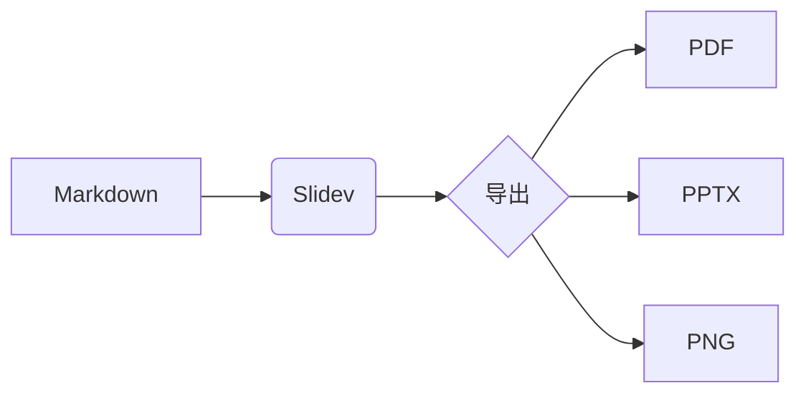

# md2pdf

用 Markdown 写幻灯片，导出逐页 PDF

<div class="pt-12">
  <span class="px-2 py-1 rounded bg-teal-400/20 text-teal-400">
    每页用 --- 分隔
  </span>
</div>

---

# 第二页：列表与强调

- 支持 **Markdown** 语法
- 支持 `代码`、公式与 Mermaid
- 支持图片、表格、代码高亮

$$
E = mc^2
$$

---

# 第三页：代码块

```python
import numpy as np

def fidelity(rho, sigma):
    return np.real(np.trace(rho @ sigma))
```

---

# 第四页：Mermaid 图



---

# 收尾

用 `pnpm export:pdf` / `npm run export:pdf` 生成逐页 PDF

<div class="text-sm opacity-60">
  幻灯片内容到此结束
</div>
