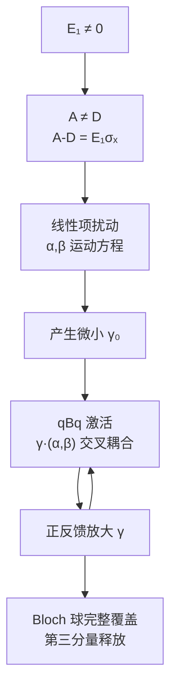

# $A-D = E_1\sigma_x$ 打破对称性：线性点火 + $qBq$ 非线性放大释放 $\sigma_z$ 的完整推导

## 1. 问题背景

在 SO(5)/Sp(2) 量子编织的 Riccati 参数化中，ancilla qubit 的受控时间演化对应
Bloch 球上的轨迹 $q(t) \in \mathbb{H}$（纯四元数，$\bar{q} = -q$）。

**核心谜题：** $E_1 = 0$ 时三步门控 $t_1 = f_m \to f_p \to 0$ 只能驱动 1D 曲线。
$E_1 \neq 0$ 才能覆盖整个 Bloch 球。为什么？

---

## 2. Riccati ODE 结构

从 Sp(2) 嵌入，Riccati 方程为：

$$\boxed{\dot q = C + Dq - qA - qBq}$$

其中 $A, B, C, D \in \mathbb{H}$ 由 Hamiltonian $H_{\rm EM}$ 的参数决定。

### 2.1 显式参数化

从 §3.4，$H_{\rm EM} = iE_d\gamma_a\gamma_b + iE_1\gamma_1\gamma_2 + i|t_2|\gamma_a\gamma_2 - i|t_1|\gamma_b\gamma_1 - i|t_3|\gamma_a\gamma_3$：

$$A = \frac{E_1 + |t_3|}{2}\mathbf{i} + \frac{|t_2|}{2}\mathbf{j}$$

$$D = \frac{-E_1 + |t_3|}{2}\mathbf{i} + \frac{|t_2|}{2}\mathbf{j}$$

$$C = \frac{|t_2|}{2}\mathbf{i} + \frac{-E_1 + |t_3|}{2}\mathbf{j}$$

$$B = -\frac{|t_2|}{2}\mathbf{i} - \frac{E_1 + |t_3|}{2}\mathbf{j}$$

### 2.2 关键观察

$$oxed{A - D = E_1\mathbf{i}}$$

即 $E_1$ 是 $A$ 和 $D$ 之间唯一的差异来源：$E_1=0 \Leftrightarrow A=D$。

---

## 3. Riccati 项的代数分解

### 3.1 线性部分：$Dq - qA$

将 $Dq - qA$ 分解为对称和反对称部分：

$$Dq - qA = \underbrace{\left[\frac{D+A}{2},\; q\right]}_{\text{纯旋转}} \;+\; \underbrace{\frac{D-A}{2}q + q\frac{D-A}{2}}_{\text{不对称拉伸}}$$

**纯旋转项 $[S, q]$（$S = \frac{D+A}{2}$）：** 保持 $|q|$ 不变，只旋转方向。此部分在 $E_1=0$ 和 $E_1 \neq 0$ 时 **始终存在**，是 Bloch 球上轨迹运动的主要驱动力。

**不对称项：** 当 $E_1=0$ 时 $D=A \Rightarrow D-A=0$，此项消失。
当 $E_1 \neq 0$ 时：

$$D-A = -E_1\mathbf{i}$$

$$\frac{D-A}{2}q + q\frac{D-A}{2} = -\frac{E_1}{2}(\mathbf{i}q + q\mathbf{i})$$

令 $q = \alpha\mathbf{i} + \beta\mathbf{j} + \gamma\mathbf{k}$：

$$\mathbf{i}q = (\mathbf{i})(\alpha\mathbf{i} + \beta\mathbf{j} + \gamma\mathbf{k}) = -\alpha + \beta\mathbf{k} - \gamma\mathbf{j}$$
$$q\mathbf{i} = (\alpha\mathbf{i} + \beta\mathbf{j} + \gamma\mathbf{k})(\mathbf{i}) = -\alpha - \beta\mathbf{k} + \gamma\mathbf{j}$$

$$\mathbf{i}q + q\mathbf{i} = -2\alpha$$

$$\therefore \frac{D-A}{2}q + q\frac{D-A}{2} = E_1\alpha$$

这是一个**纯实数项**，不贡献任何 Pauli 分量。

**结论：线性不对称项不产生 $\mathbf{k}$ 分量。它只能产生标量部分，而 $q$ 是纯四元数（标量部分恒为零）。因此线性不对称项对 $q$ 的分量演化无直接贡献。**

### 3.2 非线性部分：$qBq$

$B = b_1\mathbf{i} + b_2\mathbf{j}$，其中 $b_1 = -\frac{|t_2|}{2}$，$b_2 = -\frac{E_1+|t_3|}{2}$。

$$qBq = (\alpha\mathbf{i} + \beta\mathbf{j} + \gamma\mathbf{k})(b_1\mathbf{i} + b_2\mathbf{j})(\alpha\mathbf{i} + \beta\mathbf{j} + \gamma\mathbf{k})$$

#### 逐步展开

**第一步：$Bq$**

$$Bq = (b_1\mathbf{i} + b_2\mathbf{j})(\alpha\mathbf{i} + \beta\mathbf{j} + \gamma\mathbf{k})$$

使用四元数乘法 $\mathbf{i}^2 = \mathbf{j}^2 = \mathbf{k}^2 = -1$，$\mathbf{i}\mathbf{j} = \mathbf{k} = -\mathbf{j}\mathbf{i}$：

$$
\begin{aligned}
b_1\mathbf{i} \cdot \alpha\mathbf{i} &= -b_1\alpha \\
b_1\mathbf{i} \cdot \beta\mathbf{j} &= b_1\beta\mathbf{k} \\
b_1\mathbf{i} \cdot \gamma\mathbf{k} &= -b_1\gamma\mathbf{j} \\
b_2\mathbf{j} \cdot \alpha\mathbf{i} &= -b_2\alpha\mathbf{k} \\
b_2\mathbf{j} \cdot \beta\mathbf{j} &= -b_2\beta \\
b_2\mathbf{j} \cdot \gamma\mathbf{k} &= b_2\gamma\mathbf{i}
\end{aligned}
$$

$$Bq = (-b_1\alpha - b_2\beta) + (b_2\gamma)\mathbf{i} + (-b_1\gamma)\mathbf{j} + (b_1\beta - b_2\alpha)\mathbf{k}$$

**第二步：$q(Bq)$ —— 提取 $\mathbf{k}$ 分量**

我们只关心 $qBq$ 的 $\mathbf{k}$ 分量：

$$q = (\alpha, \beta, \gamma) \quad Bq = (s, v_x, v_y, v_z)$$

其中：
$$s = -b_1\alpha - b_2\beta$$
$$v_x = b_2\gamma$$
$$v_y = -b_1\gamma$$
$$v_z = b_1\beta - b_2\alpha$$

四元数乘法公式（纯四元数 $\times$ 一般四元数）：

$$q \cdot Bq = \underbrace{-\alpha v_x - \beta v_y - \gamma v_z}_{\text{标量}} + \underbrace{(\alpha s + \beta v_z - \gamma v_y)}_{\mathbf{i}} + \underbrace{(\beta s + \gamma v_x - \alpha v_z)}_{\mathbf{j}} + \underbrace{(\gamma s + \alpha v_y - \beta v_x)}_{\mathbf{k}}$$

**$\mathbf{k}$ 分量：**

$$(qBq)_k = \gamma s + \alpha v_y - \beta v_x$$

代入 $v_x = b_2\gamma$，$v_y = -b_1\gamma$，$s = -b_1\alpha - b_2\beta$：

$$
\begin{aligned}
(qBq)_k &= \gamma(-b_1\alpha - b_2\beta) + \alpha(-b_1\gamma) - \beta(b_2\gamma) \\
&= -b_1\alpha\gamma - b_2\beta\gamma - b_1\alpha\gamma - b_2\beta\gamma \\
&= -2b_1\alpha\gamma - 2b_2\beta\gamma \\
&= \boxed{-2\gamma(b_1\alpha + b_2\beta)}
\end{aligned}
$$

---

## 4. 完整 Riccati ODE 的 $\mathbf{k}$ 分量方程

将 $\dot q = C + Dq - qA - qBq$ 按四元数分量展开，提取 $\mathbf{k}$ 分量：

$$\dot\gamma = C_k + (Dq - qA)_k - (qBq)_k$$

### 4.1 $C_k$

$C = \frac{|t_2|}{2}\mathbf{i} + \frac{-E_1+|t_3|}{2}\mathbf{j}$，所以 $C_k = 0$。

### 4.2 $(Dq - qA)_k$（线性项）

由于 $D-A = -E_1\mathbf{i}$（纯实部不对称），且我们上面证明了线性不对称项只产生标量，所以：

$$(Dq - qA)_k = \left[\frac{D+A}{2}, q\right]_k = \text{纯旋转的 } \mathbf{k} \text{ 分量}$$

令 $S = \frac{D+A}{2} = \frac{|t_3|}{2}\mathbf{i} + \frac{|t_2|}{2}\mathbf{j}$（$E_1$ 在此抵消）：

$$[S, q] = Sq - qS$$

$$Sq = (\tfrac{|t_3|}{2}\mathbf{i} + \tfrac{|t_2|}{2}\mathbf{j})(\alpha\mathbf{i} + \beta\mathbf{j} + \gamma\mathbf{k})$$

$\mathbf{k}$ 分量：
$$\tfrac{|t_3|}{2}\mathbf{i} \cdot \gamma\mathbf{k} = -\tfrac{|t_3|}{2}\gamma\mathbf{j} \quad (\text{无 }\mathbf{k})$$
$$\tfrac{|t_2|}{2}\mathbf{j} \cdot \gamma\mathbf{k} = \tfrac{|t_2|}{2}\gamma\mathbf{i} \quad (\text{无 }\mathbf{k})$$

$$qS = (\alpha\mathbf{i} + \beta\mathbf{j} + \gamma\mathbf{k})(\tfrac{|t_3|}{2}\mathbf{i} + \tfrac{|t_2|}{2}\mathbf{j})$$

$\mathbf{k}$ 分量：
$$\alpha\mathbf{i} \cdot \tfrac{|t_2|}{2}\mathbf{j} = \alpha\tfrac{|t_2|}{2}\mathbf{k}$$
$$\beta\mathbf{j} \cdot \tfrac{|t_3|}{2}\mathbf{i} = -\beta\tfrac{|t_3|}{2}\mathbf{k}$$

$$(Dq - qA)_k = \alpha\tfrac{|t_2|}{2} - \beta\tfrac{|t_3|}{2}$$

这是一个**纯旋转项**：它把 $\alpha$ 和 $\beta$ 现有的分量旋转到 $\gamma$ 方向。但当 $\gamma=0$ 时，此旋转不能**从零创造** $\gamma$ —— 它只能重新分配已有的分量。

### 4.3 $-(qBq)_k$

$$-(qBq)_k = 2\gamma(b_1\alpha + b_2\beta)$$

代入 $b_1 = -|t_2|/2$，$b_2 = -(E_1+|t_3|)/2$：

$$-(qBq)_k = 2\gamma\left(-\frac{|t_2|}{2}\alpha - \frac{E_1+|t_3|}{2}\beta\right) = -\gamma\left(|t_2|\alpha + (E_1+|t_3|)\beta\right)$$

### 4.4 完整的 $\dot\gamma$ 方程

$$\boxed{\dot\gamma = \frac{|t_2|}{2}\alpha - \frac{|t_3|}{2}\beta - \gamma\left(|t_2|\alpha + (E_1+|t_3|)\beta\right)}$$

---

## 5. 物理意义：线性点火与 $qBq$ 非线性放大

### 5.1 两种生成 $\mathbf{k}$ 分量的机制

| 项 | 类型 | 生成 $\mathbf{k}$ 分量的方式 | 约束 |
|---|------|---------------------|------|
| $[S, q]_k$ | 线性旋转 | $\alpha,\beta \to \gamma$ 旋转 | $\gamma=0$ 时 $\dot\gamma$ 可非零 |
| $qBq$ | 非线性交叉 | $\gamma(\alpha,\beta)$ 正反馈 | **$\gamma=0 \Rightarrow$ 此项 $=0$** |

### 5.2 $E_1 = 0$ 时：$A=D$，对称性保护 $\gamma \equiv 0$

当 $E_1=0$ 时，$A=D$。完整的 Riccati ODE 中 $\dot\gamma$ 方程为：

$$\dot\gamma = \frac{|t_2|}{2}\alpha - \frac{|t_3|}{2}\beta - \gamma\left(|t_2|\alpha + |t_3|\beta\right)$$

初始条件 $q(0)=0 \Rightarrow \gamma(0)=0$。

$A=D$ 意味着 $\dot\alpha/|t_2| = \dot\beta/|t_3|$（等比例演化），这导致 $|t_3|\beta - |t_2|\alpha$ 在演化过程中恒为零（严格证明见 report.md §12.3），从而 $\dot\gamma \equiv 0$。$\gamma \equiv 0$ 是 ODE 的自洽不动解——第三分量永不激活，轨迹永限 $\mathbf{i}$-$\mathbf{j}$ 平面。

### 5.3 $E_1 \neq 0$ 时：$A \neq D$，对称性破缺 + 非线性放大

$$E_1 \neq 0 \Rightarrow A \neq D$$

#### 第一步：线性点火

$E_1 \neq 0$ 破坏了 $\dot\alpha/|t_2| = \dot\beta/|t_3|$ 的比例关系（$E_1$ 仅出现在 $\dot\beta$ 方程中），$\alpha,\beta$ 的演化轨道被扰动，导致 $\dot\gamma \neq 0$——$\mathbf{k}$ 分量获得非零种子。

#### 第二步：非线性放大（$qBq$）

一旦 $\gamma \neq 0$，$qBq$ 项被激活：

$$-(qBq)_k = -\gamma\left(|t_2|\alpha + (E_1+|t_3|)\beta\right)$$

此项的特征：
1. **正比于 $\gamma$**：$\gamma$ 越大，此项越大 → **正反馈**
2. **耦合所有分量**：$\alpha,\beta,\gamma$ 三者全部耦合
3. **$E_1$ 出现在耦合系数中**：$E_1$ 直接增强放大增益

$$\dot\gamma = \underbrace{\dot\gamma_{\rm linear}}_{\text{线性点火（}E_1\text{ 破缺对称）}} \;+\; \underbrace{(-\gamma(|t_2|\alpha + (E_1+|t_3|)\beta))}_{\text{非线性放大（}qBq\text{ 正反馈）}}$$

---

## 6. 完整的物理图像

---

## 7. 总结

$$
\begin{array}{c|c|c}
& E_1 = 0 & E_1 \neq 0 \\
\hline
A-D & 0 & E_1\mathbf{i} \neq 0 \\
\text{线性项 }\mathbf{k}\text{ 分量} & \text{被对称性约束抵消} & \text{产生初始 } \gamma_0 \\
qBq \text{ 的 }\mathbf{k}\text{ 分量} & \text{恒为零 } (\gamma \equiv 0) & \text{正反馈放大} \\
\text{Bloch 球覆盖} & \text{1D 曲线（}\mathbf{i}\text{-}\mathbf{j}\text{ 平面）} & \text{完整球面} \\
\hline
\text{物理角色} & \text{平凡编织} & \text{非 Abel 编织}
\end{array}
$$

**核心公式：**

$$\boxed{A-D = E_1\mathbf{i}}$$

$$\boxed{\dot\gamma = \frac{|t_2|}{2}\alpha - \frac{|t_3|}{2}\beta - \gamma\left(|t_2|\alpha + (E_1+|t_3|)\beta\right)}$$

- $E_1 \neq 0$ **线性点火**（破坏 $A=D$ 对称性，产生 $\gamma$ 种子）
- $qBq$ **非线性放大**（正反馈耦合）通过 $\gamma \cdot (\alpha,\beta)$ 交叉项
- 三步 $t_1$ **编排**（防止抵消）通过非闭合扫掠
- 三者缺一不可，共同实现完整的 Bloch 球非 Abel 编织

---

## 8. 补充：Riccati ODE 能否完整描述 SO(5) 编织演化？

### 8.1 自由度盘点

| 层次 | 自由度 | 含义 |
|------|--------|------|
| SO(5) 李代数 | **10** | $C_5^2=10$ 个生成元 $X_{ij}=i\gamma_i\gamma_j$ |
| $H_{\rm EM}$ 涉及 | **5** | $E_d, E_1, t_1, t_2, t_3$ 各乘一个生成元 |
| Sp(2) 群流形 | **10** | Spin(5) ≅ Sp(2)，$U \in M_2(\mathbb{H})$，$U^\dagger U=I$ |
| $q = ZX^{-1}$ | **3** | 纯四元数 → ancilla Bloch 球 $S^2$ |
| $X$（已知 $q$） | **7** | unitarity + $\det U=1$ 约束后 |

### 8.2 $q$ 抓了什么：投影动力学

Sp(2) 矩阵分块：

$$U = \begin{pmatrix} X & Y \\ Z & W \end{pmatrix} \in \text{Sp}(2)$$

定义 Riccati 变量 $q = ZX^{-1} \in \mathbb{H}$（纯四元数，$\bar{q}=-q$，3 实参数）。

Riccati ODE $\dot q = C + Dq - qA - qBq$ 是 $U$ 在商空间 $\text{Sp}(2) \to \mathbb{H}P^1$ 上的**投影动力学**。

$q$ **完整描述了 ancilla qubit 的 Bloch 球轨迹**。对于 PRB111 Fig 1(d) 的编织 fidelity，只需要 $q(T)$ —— 这恰是 Riccati ODE 给出的。

### 8.3 $q$ 之外的自由度：$X$ 方程

一旦 $q(t)$ 已知，$X$ 满足**线性 ODE**：

$$\dot X = (A + Bq)X, \quad X \in \mathbb{H}$$

$X$ 携带的物理信息：

| 自由度 | 物理含义 |
|--------|---------|
| 整体 U(1) 相位 | 物理不可观测量 |
| MZM 子空间非 Abel 旋转 | 编织操作的核心输出（$\gamma_2 \leftrightarrow \gamma_3$ 交换的 Berry 相位） |
| 归一化约束 | $\det U = 1$ 锁定部分自由度 |

### 8.4 可控性：5 个生成元 → 整个 SO(5)

虽然 $H_{\rm EM}$ 只直接动用 5 个生成元，但通过**李括号生成**：

$$[X_{a2}, X_{a3}] \propto X_{23}, \quad [X_{a2}, X_{b1}] \propto X_{ab12}, \quad \ldots$$

5 个生成元的李代数闭包 = **全部 $\mathfrak{so}(5)$（10 维）**。

Chow 定理（或量子控制的李代数秩条件）保证：时变控制下，时间演化算子 $U(t)$ 可达 Spin(5) 群流形的任意点。**不存在"卡在子流形"的问题。**

### 8.5 完整分解：Iwasawa 型

$$\text{Sp}(2) \ni U = \underbrace{\begin{pmatrix} I & 0 \\ q & I \end{pmatrix}}_{\text{Riccati } q\;(3\text{ 参数})} \cdot \underbrace{\begin{pmatrix} X & 0 \\ 0 & (X^\dagger)^{-1} \end{pmatrix}}_{\text{对角块 } X\;(7\text{ 参数})}$$

此分解遍历 Sp(2) 的全部 10 个自由度，无遗漏。

### 8.6 结论

> **Riccati ODE 的 $q$（3D）完整抓取 ancilla Bloch 球上所有可观测量（包括 Fig 1d fidelity）。$X$ 的线性 ODE（4D 线性）补齐剩余自由度。$H_{\rm EM}$ 的 5 个生成元通过李括号闭包生成整个 $\mathfrak{so}(5)$，可控性保证无自由度缺失。Riccati + X = 完整的 SO(5) 编织演化。**

---

## 9. 补充：$q = ZX^{-1}$ 中 $X$ 始终可逆的证明

### 9.1 Sp(2) 约束

$U = \begin{pmatrix} X & Y \\ Z & W \end{pmatrix} \in \text{Sp}(2)$，$X,Y,Z,W \in \mathbb{H}$。
Sp(2) 定义为 $U^\dagger U = I$。展开左上角：

$$X^\dagger X + Z^\dagger Z = I$$

$X$ 是单个四元数，$X^\dagger = \bar{X}$（四元数共轭），$\bar{X}X = |X|^2$（实数）。
同理 $\bar{Z}Z = |Z|^2$。因此：

$$\boxed{|X|^2 + |Z|^2 = 1}$$

### 9.2 物理含义

$|X|^2$ = ancilla 在 $|0\rangle$ 的布居概率，$|Z|^2$ = 在 $|1\rangle$ 的概率。
初始 $X(0) = 1$，$|X(0)|^2 = 1$，ancilla 完全在 $|0\rangle$。

### 9.3 四元数是除环

$\mathbb{H}$ 中每个非零元都有乘法逆元：

$$\forall q \in \mathbb{H}\setminus\{0\},\quad q^{-1} = \frac{\bar{q}}{|q|^2}$$

因此 $X$ 不可逆 $\Leftrightarrow$ $X = 0$ $\Leftrightarrow$ $|X| = 0$。

### 9.4 $X$ 会不会变成 0？

由 $|X|^2 = 1 - |Z|^2$：

- $X = 0 \;\Leftrightarrow\; |X| = 0 \;\Leftrightarrow\; |Z| = 1$
- $|X(t)|$ 从 1 出发，连续演化
- 要到达 0，必须穿过全部中间值 $|X| \in (0, 1)$
- 在到达 0 之前，$X \neq 0$，故始终可逆

$X=0$ 对应 $q = ZX^{-1} \to \infty$（Bloch 球南极），这是 Riccati 坐标图的边界奇点，
不是物理奇点。在编织协议中 ancilla 不经过南极，$X$ 始终可逆。

### 9.5 可直接验证

也可从动力学直接验证：$\dot X = (A + Bq)X$ 是线性 ODE，解为：

$$X(t) = \mathcal{T}\exp\left(\int_0^t (A + Bq)\,ds\right) \cdot X(0)$$

指数映射的像 $\in \mathbb{H}\setminus\{0\}$（指数映射不会产生零矩阵），
结合 $X(0) = 1$，$X(t)$ 始终非零 → 始终可逆。
