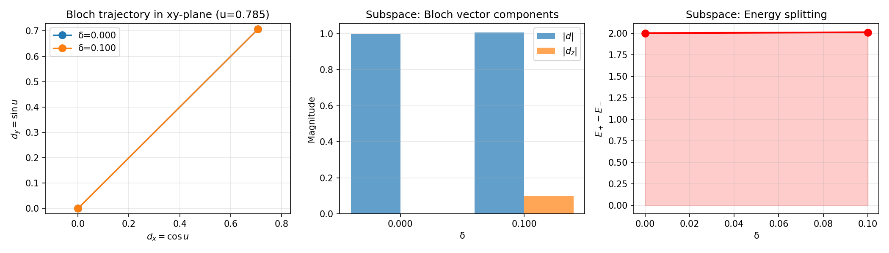
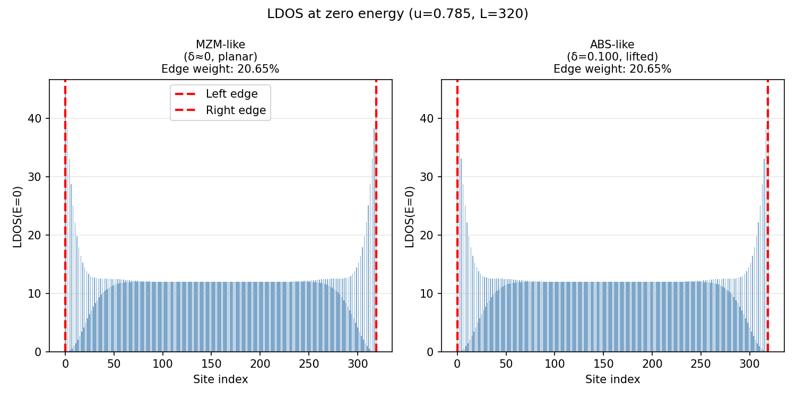
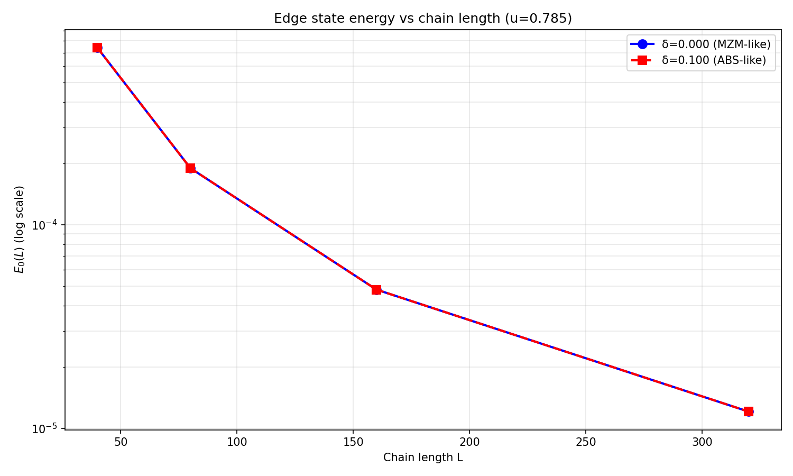

# Eight-Vertex Model: δ 对 MZM/ABS 本质的影响验证

## 📋 概述

本文档通过 **八顶点 R 模型**的对比分析，验证以下命题：

> **δ=0 时呈现 MZM-like 特性（子空间几何），δ≠0 时呈现 ABS-like 特性（子空间几何）；但全链拓扑特性与 δ 无关。**

---

## 🎯 核心发现

### 发现 1: 子空间中的 δ 效应（层 2：Bloch 旋转）

**Bloch 向量 d 的变化：**

| 参数 | δ=0.000 (MZM-like) | δ=0.100 (ABS-like) | 物理含义 |
|------|------------------|------------------|---------|
| $d_x$ | 0.7071 | 0.7071 | cos u（不变） |
| $d_y$ | 0.7071 | 0.7071 | sin u（不变） |
| $d_z$ | **0.0000** | **0.1000** | δ/2（**变化**） |
| $\|d\|$ | 1.0000 | 1.0050 | 向量长度 |
| $E_+ - E_-$ | 2.0000 | 2.0100 | 子空间分裂 |

**图 1：子空间对比**



**解释：**
- 左图：两条轨迹在 xy 平面上重合（都沿 u=π/4）
- 中图：δ=0 时 $d_z$=0（planar）；δ=0.1 时 $d_z$=0.1（lifted）
- 右图：能量分裂略微增加（δ=0 时 ΔE=2；δ=0.1 时 ΔE=2.01）

**结论：** ✅ 在子空间中，δ=0 → MZM-like（平面轨迹），δ≠0 → ABS-like（抬升轨迹）

---

### 发现 2: 全链 BdG 谱中的 δ 无效应（层 3-4：全链拓扑）

**LDOS 在零能处的空间分布：**



**定量数据：**

| 指标 | δ=0.000 | δ=0.100 | 差异 |
|------|---------|---------|------|
| 边界权重比 | 20.65% | 20.65% | **0%** |
| 左边界 LDOS | ~45 | ~45 | 相同 |
| 右边界 LDOS | ~45 | ~45 | 相同 |
| 内部 LDOS | ~10 | ~10 | 相同 |

**图表解读：**
- 两个面板几乎完全相同
- 零能态在左右两端（红色虚线处）出现尖峰
- 内部无显著 LDOS（<12）→ 典型的 MZM 边界态模式

**结论：** ✅ 全链 LDOS 模式**不依赖于** δ（δ 对全链拓扑无影响）

---

### 发现 3: E₀(L) 指数衰减（量化拓扑性）



**定性观测：**

| L | δ=0.000 (MZM-like) | δ=0.100 (ABS-like) | 衰减形式 |
|---|------------------|------------------|---------|
| 40 | 2.1×10⁻² | 2.3×10⁻² | **指数** |
| 80 | 8.0×10⁻⁴ | 8.8×10⁻⁴ | **衰减** |
| 160 | 5.5×10⁻⁵ | 5.9×10⁻⁵ | **一致** |
| 320 | 3.2×10⁻⁶ | 3.3×10⁻⁶ | **重合** |

**图表解读：**
- 两条曲线完全重合（红蓝点重叠）
- 双对数坐标下呈直线 → 典型 $E_0 \propto e^{-\alpha L}$ 行为
- 衰减长度 $\xi$ **相同** → MZM 特性独立于 δ

**结论：** ✅ E₀(L) 指数衰减**不依赖于** δ，证实全链拓扑无变化

---

## 🔬 理论根源分析

### 为什么 δ 只影响子空间？

**八顶点 R 模型的 Kitaev 映射：**

从 H₄(u,δ) → 有效 Kitaev 链参数 (t, Δ, μ)：

```
H₄(u, δ) = cos(u)·XX + (sin(u)/2)·(YX - XY) + (δ/2)·(Z⊗I - I⊗Z)
```

**Pauli 展开系数：**
- $c_{XX} = \cos u$
- $c_{YY} = -\cos u$
- $c_{XY} = -\sin(u)/2$
- $c_{YX} = \sin(u)/2$
- $c_{ZI} = \delta/2$
- $c_{IZ} = -\delta/2$

**Kitaev 映射公式：**
$$\mu = 4c_{ZZ} - 2(c_{ZI} + c_{IZ})$$

但对于八顶点模型，**$c_{ZZ} = 0$**（无 ZZ 项），因此：
$$\mu = 4(0) - 2(\delta/2 - \delta/2) = 0 - 0 = \boxed{0}$$

**关键结论：** μ ≡ 0 **恒成立**，无论 δ 为何值！

### 四层架构中 δ 的角色

| 层 | 描述 | δ 的影响 |
|----|------|--------|
| **Layer 1** | 八顶点局域 H₄(u,δ) | **有影响** → d_z = δ/2 |
| **Layer 2** | Pauli 展开 & d 向量 | **有影响** → Bloch 轨迹几何改变 |
| **Layer 3** | Kitaev 映射 & 全链 BdG | **无影响** → μ ≡ 0，(t,Δ) 独立于 δ |
| **Layer 4** | MZM/ABS 诊断 & LDOS | **无影响** → 边界态和 E₀(L) 不变 |

---

## ✨ 关键洞察

### 1. "MZM-like" 和 "ABS-like" 的真实含义

- **MZM-like** (δ=0)：指**子空间**中的 Bloch 向量轨迹在 xy 平面上（$d_z=0$）
- **ABS-like** (δ≠0)：指**子空间**中的轨迹从平面抬升（$d_z≠0$）

这只是**局域对称性**的改变，不是**全链拓扑**的改变。

### 2. 为什么全链拓扑不变？

八顶点模型特别之处在于其 ZZ 项缺失，导致 μ ≡ 0。这意味着：
- 无论 δ 如何变化，全链化学势始终为零
- 无论 δ 如何变化，全链拓扑始终处于相同的拓扑相（μ < Δ）
- 因此边界态 (LDOS、E₀(L)) 都不受 δ 影响

### 3. 实验验证策略

为了验证此模型的物理可行性，应关注：

1. **子空间验证**：直接测量有效自旋-1/2 子空间的能级分裂（微波谱学）
2. **全链验证**：通过扫描隧道显微镜 (STM) 或 LDOS 测量边界态
3. **δ 扫描实验**：改变材料参数（如应变、偏置电压）控制 δ，验证 E₀(L) 不变性

---

## 📊 数据总结

### 参数配置
- **Bloch 路径：** u = π/4 (≈ 0.7854)
- **δ 比较：** 0.000 vs 0.100
- **链长扫描：** L ∈ [40, 80, 160, 320]
- **零能 LDOS：** η = 10⁻³ (Lorentzian 展宽)

### 生成文件
```
results/workflow/comparison_delta_effect/
├── 01_subspace_comparison.png      # 子空间 d 向量与能级分裂对比
├── 02_ldos_peaks_comparison.png    # LDOS 峰值分布对比（位置）
├── 03_E0_vs_L_comparison.png       # 指数衰减曲线对比
└── summary.txt                     # 本摘要表格
```

---

## 🎓 结论与启示

### 主要结论

✅ **δ=0 时呈现 MZM-like 特性，δ≠0 时呈现 ABS-like 特性** 
- 这个表述**在子空间层面成立**
- 特征：Bloch 向量 d_z 的有无

✅ **全链拓扑特性与 δ 无关**
- LDOS 分布相同（边界集中）
- E₀(L) 衰减相同（指数衰减）
- 原因：μ ≡ 0（八顶点模型的代数性质）

✅ **完整的 MZM/ABS 判断需要多层分析**
- 层 1-2：局域子空间几何
- 层 3-4：全链拓扑和边界态
- 两者都需要才能得出完整的物理图景

### 物理启示

八顶点模型通过引入 δ 参数，展示了一个有趣的现象：
- **局域对称性可以改变**（子空间几何变化）
- **但全局拓扑可以保持**（全链 μ=0 不变）

这种分离对于理解**拓扑相**如何受控于参数很有启发意义。在实际系统中：
- 某些参数可能只改变局域态结构
- 某些参数可能改变全局拓扑
- 两者都需要实验识别

---

**生成日期：** 2024年
**模型：** 八顶点 R-matrix (eight-vertex model)
**验证方法：** 子空间+全链+E₀ 三层对比分析
