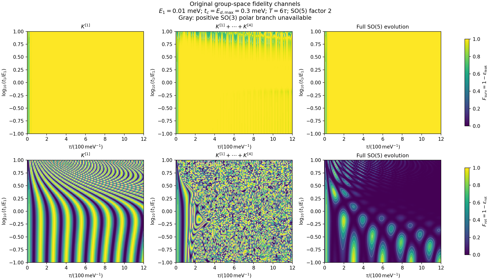
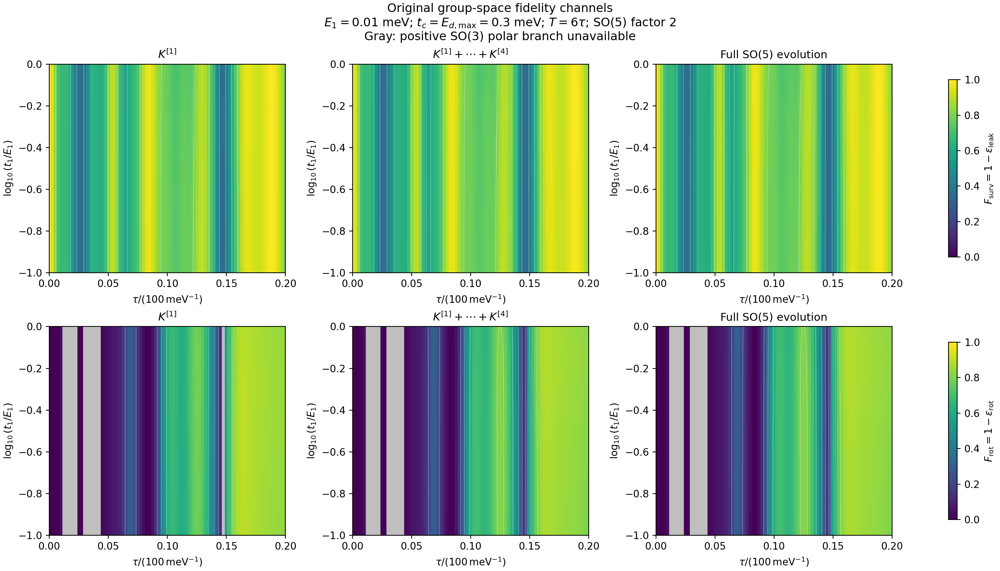

# 高阶生成元如何影响子空间泄漏与内部旋转

本文重新推导并分别验证两个既定误差：

$$
\varepsilon_{\rm leak}=1-F_{\rm surv},
\qquad
\varepsilon_{\rm rot}=1-F_{\rm rot}.
$$

目标是识别 $E_1,t_1$ 的高阶项通过哪些生成元、哪些混合项作用于它们。保真度定义保持不变，不引入单粒子态重叠。

上一版中，将零点四阶保真度多项式直接外推到整张论文参数图的部分已经撤出主线。旧 n6、两份绘图脚本及其输出移至[可恢复归档](archive/retracted_parameter_extrapolation_20260926.A66H4Y/README.md)。原始模型、完整演化绘图代码及有效的局部系数验证保留。新的推导和验证不以那些外推图为依据。

## 1. 模型、参数与阶数约定

使用 $(\gamma_1,\gamma_2,\gamma_3,\gamma_a,\gamma_b)$ 的顺序，记

$$
E=E_1,\qquad g=t_1,\qquad
\partial_u R=\Omega(u;E,g)R,\qquad R(0)=I_5,
$$

$$
\Omega=2
\begin{pmatrix}
0&E&0&0&gf\\
-E&0&0&-t_2&0\\
0&0&0&t_3&0\\
0&t_2&-t_3&0&E_d\\
-gf&0&0&-E_d&0
\end{pmatrix}
=\Omega_0+E\Omega_E+g\Omega_g.
$$

$g$ 是耦合幅度，实际时变耦合为 $gf(u)$。保留归一化因子 $2$，取 $\hbar=1$。能量单位为 meV，时间单位为 $\mathrm{meV}^{-1}$。

每段时长为 $\tau$，局部时间 $s\in[0,1]$，$f_\pm(s)=(1\pm\cos\pi s)/2$：

| 段 | $t_2$ | $t_3$ | $E_d$ | $f$ |
|---|---|---|---|---|
| 1 | $0.3f_-$ | $0$ | $0.3f_+$ | $f_-$ |
| 2 | $0.3f_+$ | $0.3f_-$ | $0$ | $f_+$ |
| 3 | $0$ | $0.3f_+$ | $0.3f_-$ | $0$ |

重复两次，总时间 $T=6\tau$，理想双编织的有效子空间矩阵为

$$
B=B_{23}^2=\operatorname{diag}(1,-1,-1).
$$

每次参数展开均固定协议及 $\tau$。上标 $[j]$ 表示关于 $(E,g)$ 的 $j$ 次齐次部分，包含全部 $E^mg^n,\ m+n=j$，不是时间积分算法的阶数。余项使用无量纲化后的参数尺度 $\rho$ 表示。

## 2. 两种误差的精确定义

取 $P$ 为前三个 Majorana 张成的子空间，$Q=I-P$。在终点分块

$$
R(T)=\begin{pmatrix}M&L\\N&Q_R\end{pmatrix}.
$$

由正交性，

$$
M^TM+N^TN=I_3.
$$

因此

$$
\boxed{\varepsilon_{\rm leak}=\frac13\|N\|_F^2.}
$$

这是完整定义。它对 $N$ 是二次式，但 $N(E,g)$ 一般包含任意阶参数响应。

对可逆且 $\det M>0$ 的块取左极分解

$$
M=HU,\qquad H=(MM^T)^{1/2}>0,\qquad U\in SO(3),
$$

定义

$$
\boxed{\varepsilon_{\rm rot}
=\frac{3-\operatorname{Tr}(B^TU)}4.}
$$

若 $B^TU$ 的旋转角为 $\vartheta$，则 $\varepsilon_{\rm rot}=\sin^2(\vartheta/2)$。这一等式本身没有小角度近似。

两者分别描述子空间偏离和内部旋转偏离。当前 $3+2$ 划分下，$\operatorname{rank}N\leq2$，故 $0\leq\varepsilon_{\rm leak}\leq2/3$；同时 $0\leq\varepsilon_{\rm rot}\leq1$。当 $M$ 奇异时，极分解旋转可能不唯一；当 $\det M<0$ 时，正极分解因子属于 $O(3)$ 的另一分支。本文的局部旋转展开只使用光滑的 $SO(3)$ 分支。

在 Grassmann 图坐标 $Z=NM^{-1}$ 中，令 $S_Z=(I+Z^TZ)^{1/2}$，则

$$
U=S_ZM,\qquad
M=S_Z^{-1}U,\qquad N=ZS_Z^{-1}U,
$$

$$
\varepsilon_{\rm leak}
=1-\frac13\operatorname{Tr}(I+Z^TZ)^{-1}.
$$

这些是同一误差的不同坐标表达。三个正交列构成 $SO(5)/SO(2)$ 上的标架；局部可用六个子空间坐标与三个内部旋转坐标描述。

## 3. 先保留有限时间的基准误差

定义零缺陷基准和相对演化

$$
R_0(u)=R(u;0,0),\qquad
\mathcal S(u;E,g)=R_0(u)^TR(u;E,g).
$$

则 $\mathcal S(u;0,0)=I_5$，且

$$
\partial_u\mathcal S=V\mathcal S,\qquad
V=E V_E+g V_g,
$$

$$
V_E=R_0^T\Omega_E R_0,\qquad
V_g=R_0^T\Omega_g R_0.
$$

这样，高阶参数效应可以围绕相对演化的单位元分析。

必须保留两个层次：

* **相对误差**：用 $\mathcal S$ 的分块，旋转目标取 $I_3$，描述相对于同一有限时间基准的额外偏离。
* **绝对误差**：用 $R=R_0\mathcal S$ 的分块，旋转目标取 $B$，描述是否实现理想编织。这是最终物理报告的指标。

只有在 $R_0(T)=\operatorname{diag}(B,Q_0)$ 本身理想时，二者才一致。一般不能把相对误差直接当成绝对误差，也不能简单相加；第 10 节给出严格还原关系。

扩展参数流形 $[0,T]\times\mathcal P$ 的观点仍然成立。例如 $\mathscr K_E=(\partial_ER)R^{-1}$ 满足

$$
\partial_u\mathscr K_E=\Omega_E+[\Omega,\mathscr K_E],
\qquad
\partial_E\mathscr K_g-\partial_g\mathscr K_E-[\mathscr K_E,\mathscr K_g]=0.
$$

它提供参数求导的相容结构，但不会自动给出消除时间积分的闭式解。以下使用这一参数族的局部李代数生成元。

## 4. 从高阶生成元区分两条作用路径

在单位元附近取

$$
\mathcal S=e^K,\qquad
K=\begin{pmatrix}A&-C^T\\C&D\end{pmatrix}\in\mathfrak{so}(5),
$$

其中 $A\in\mathfrak{so}(3)$、$D\in\mathfrak{so}(2)$、$C\in\mathbb R^{2\times3}$。这里 $D$ 仅表示生成元的辅助子空间块。

再写

$$
K=K^{[1]}+K^{[2]}+K^{[3]}+\cdots,
\qquad
K^{[j]}=\begin{pmatrix}A_j&-C_j^T\\C_j&D_j\end{pmatrix}.
$$

$C$ 控制两个子空间之间的耦合；$A,D$ 描述各自内部的生成元。但是最终极分解得到的旋转对数一般不等于 $A$。这种差别正是需要推导的高阶反馈，不能提前忽略。

### 4.1 李代数分块的精确对易关系

定义

$$
h(A,D)=\begin{pmatrix}A&0\\0&D\end{pmatrix},
\qquad
m(C)=\begin{pmatrix}0&-C^T\\C&0\end{pmatrix}.
$$

直接矩阵相乘得到

$$
[h(A_1,D_1),h(A_2,D_2)]
=h([A_1,A_2],[D_1,D_2]),
$$

$$
\boxed{[h(A,D),m(C)]=m(DC-CA),}
$$

$$
\boxed{
[m(C_1),m(C_2)]
=h(C_2^TC_1-C_1^TC_2,\ C_2C_1^T-C_1C_2^T).
}
$$

因此，一般 $SO(5)$ 系统具有：

| 高阶嵌套结构 | 最终所在块 |
|---|---|
| $[h,h]$、$[m,m]$ | 内部块 $h$ |
| $[h,m]$ | 跨子空间块 $m$ |
| 三重嵌套中含偶数个 $m$ | 内部块 $h$ |
| 三重嵌套中含奇数个 $m$ | 跨子空间块 $m$ |

这说明同一高阶过程可以把跨子空间作用转化成内部作用。不过，对具体模型还必须检查哪些块由于对称性严格为零，第 5 节会作这一检查。

### 4.2 参数阶数由 Magnus 展开给出

对 $\dot{\mathcal S}=V\mathcal S$，前三阶生成元为

$$
K^{[1]}=\int_0^T V(u_1)\,du_1,
$$

$$
K^{[2]}=\frac12\int_{u_1>u_2}[V(u_1),V(u_2)]\,du_1du_2,
$$

$$
K^{[3]}=\frac16\int_{u_1>u_2>u_3}
\big([V(u_1),[V(u_2),V(u_3)]]
+[V(u_3),[V(u_2),V(u_1)]]\big)\,du_1du_2du_3.
$$

由于 $V=EV_E+gV_g$，可以明确写出

$$
\begin{aligned}
K^{[1]}&=EK_{10}+gK_{01},\\
K^{[2]}&=E^2K_{20}+EgK_{11}+g^2K_{02},\\
K^{[3]}&=E^3K_{30}+E^2gK_{21}+Eg^2K_{12}+g^3K_{03}.
\end{aligned}
$$

例如二阶混合生成元为

$$
\boxed{
K_{11}=\frac12\int_{u_1>u_2}
\big([V_E(u_1),V_g(u_2)]+[V_g(u_1),V_E(u_2)]\big)\,du_1du_2.}
$$

同一参数的生成元在不同时刻也可能不对易，因此 $K_{20},K_{02}$ 一般同样非零。

适合计算的等价递推为

$$
\dot K^{[1]}=V,\qquad
\dot K^{[2]}=-\frac12[K^{[1]},V],
$$

$$
\dot K^{[3]}=-\frac12[K^{[2]},V]
+\frac1{12}[K^{[1]},[K^{[1]},V]],
$$

并取零初值。验证程序将这条路线与独立的演化矩阵参数展开取对数进行比较。

## 5. 本模型的额外约束：不能把一般机制直接套用

零缺陷时 $\gamma_1$ 完全解耦，因此

$$
R_0(u)e_1=e_1.
$$

于是 $V_E,V_g$ 都是 $e_1$ 与其余四个方向之间的反对称耦合。它们的瞬时分块具有

$$
D_V=0,\qquad
C_V=c(u)e_1^T,
$$

其中右边 $e_1$ 现在指有效三维子空间的第一个基向量。这意味着

$$
D_1=0,\qquad C_1=c_1e_1^T,
$$

而 $A_1$ 只含 $1$–$2$、$1$–$3$ 旋转。

对两个这样的瞬时跨子空间块 $C_a=c_a e_1^T,C_b=c_b e_1^T$，有

$$
C_b^TC_a-C_a^TC_b
=(c_b^Tc_a-c_a^Tc_b)e_1e_1^T=0.
$$

所以在这个具体模型中：

$$
\boxed{
[m,m]\text{ 的二阶作用只产生辅助块 }D_2，
\text{不直接产生有效子空间块 }A_2.}
$$

二阶 $A_2$ 来自 $[h,h]$，二阶 $C_2$ 来自 $[h,m]$，二阶 $D_2$ 来自 $[m,m]$。更高阶嵌套和极分解仍然允许泄漏路径反馈到内部旋转。

忽略量子点的最终内部旋转，不等于可以删除动力学中的 $D_2$。例如它与一阶跨子空间生成元的再次对易，可以通过 $D_2C_1$ 一类结构进入三阶 $C_3$，随后参与四阶泄漏干涉。

另取 $J=\operatorname{diag}(-1,1,1,1,1)$，本模型满足

$$
K(-E,-g)=J K(E,g)J.
$$

从而奇数阶 $C_j$ 只含第一列，偶数阶 $C_j$ 只含第二、三列；奇数阶 $A_j$ 位于 $1$–$2$、$1$–$3$ 平面，偶数阶 $A_j$ 位于 $2$–$3$ 平面，奇数阶 $D_j=0$。特别地，

$$
\langle C_1,C_2\rangle_F=0,\qquad
\boldsymbol a_1\cdot\boldsymbol a_2=0,
$$

其中 $A_j=[\boldsymbol a_j]_\times$。

两种误差均满足同时反号不变性，所以零点展开的奇数总阶误差为零。三阶生成元本身可以非零，并将通过一阶与三阶的干涉进入四阶误差。

几何上，二阶响应进入了与一阶正交的新方向，所以它在误差中的领先贡献来自自身平方；三阶响应可以回到一阶方向，因而能够产生有正有负的一阶/三阶干涉。这比只按“有没有高阶项”分类更能解释两种误差的变化。

## 6. 泄漏误差：先从生成元推到实际泄漏块

本节先研究相对演化 $\mathcal S=e^K$，目标为单位元。写

$$
\mathcal S\begin{pmatrix}I_3\\0\end{pmatrix}
=\begin{pmatrix}X\\Y\end{pmatrix}.
$$

这里 $Y$ 是实际相对泄漏块；生成元中的 $C$ 并不等于 $Y$。

展开矩阵指数并取左下块：

$$
\boxed{
Y=C+\frac12(CA+DC)
+\frac16(CA^2+DCA+D^2C-CC^TC)
+O(\|K\|^4).}
$$

分别记右边前三个齐次项为 $Y_1,Y_2,Y_3$。由反对称性，

$$
\langle C,CA\rangle_F=\langle C,DC\rangle_F=0,
$$

所以泄漏范数没有关于 $K$ 的三阶项。四阶部分为

$$
\begin{aligned}
\|Y_2\|_F^2+2\langle Y_1,Y_3\rangle_F
={}&\frac14\|CA+DC\|_F^2\\
&+\frac13\langle C,CA^2+DCA+D^2C-CC^TC\rangle_F.
\end{aligned}
$$

利用

$$
\begin{aligned}
\langle C,CA^2\rangle_F&=-\|CA\|_F^2,\\
\langle C,D^2C\rangle_F&=-\|DC\|_F^2,\\
\langle C,DCA\rangle_F&=-\langle CA,DC\rangle_F,\\
\langle C,CC^TC\rangle_F&=\operatorname{Tr}[(C^TC)^2],
\end{aligned}
$$

得到

$$
\boxed{
\varepsilon_{\rm leak}^{\rm rel}(K)
=\frac13\|C\|_F^2
-\frac1{36}\|DC-CA\|_F^2
-\frac19\operatorname{Tr}[(C^TC)^2]
+O(\|K\|^6).}
$$

这里余项从六阶开始，是因为 $\mathcal S(-K)=\mathcal S(K)^T$，而正交矩阵两个非对角块的 Frobenius 范数相同，所以泄漏误差对 $K\mapsto-K$ 不变。

各项含义是：

* $\|C\|_F^2/3$：跨子空间生成元的领先贡献。
* $-\|DC-CA\|_F^2/36$：两侧内部旋转与跨子空间作用相互配合的修正。$DC-CA$ 正是 $[h,m]$ 的非对角块。
* $-\operatorname{Tr}[(C^TC)^2]/9$：有限转动的非线性修正。只存在 $C$ 时，泄漏为 $\sum_j\sin^2\sigma_j(C)/3$，该项就是其四阶部分。

后两项在固定 $A,C,D$ 下非正，但整个四阶参数修正不一定非正，因为 $C$ 本身还包含 $C_2,C_3,\ldots$。

## 7. 旋转误差：必须计入极分解反馈

相对演化的左上块为

$$
X=I+A+\frac12(A^2-G_C)
+\frac16(A^3-AG_C-G_CA-C^TDC)
+O(\|K\|^4),
\qquad G_C=C^TC.
$$

设 $X=H_{\rm rel}U_{\rm rel}$。由上式或正交性可得

$$
XX^T=I-G_C-\frac12[A,G_C]+O(\|K\|^4),
$$

$$
H_{\rm rel}^{-1}
=I+\frac12G_C+\frac14[A,G_C]+O(\|K\|^4).
$$

相乘得到

$$
U_{\rm rel}
=I+A+\frac12A^2+\frac16A^3
+\frac1{12}(AG_C+G_CA)-\frac16C^TDC
+O(\|K\|^4).
$$

因此，实际极分解旋转的对数为

$$
\boxed{
\widetilde A:=\log U_{\rm rel}
=A+\frac1{12}\{A,C^TC\}-\frac16C^TDC
+O(\|K\|^5).}
$$

$\{A,C^TC\}=A(C^TC)+(C^TC)A$ 为反对易子。它及 $C^TDC$ 都是反对称矩阵，所以仍属于 $\mathfrak{so}(3)$。

余项从五阶开始，是因为在单位元附近，$X(-K)=X(K)^T$ 的正交极因子是 $U_{\rm rel}(K)^T$，故 $\log U_{\rm rel}$ 对 $K$ 是奇函数。

这一步明确说明：**把总生成元的 $A$ 块直接当成最终旋转对数，会漏掉三阶泄漏反馈，从而漏掉四阶旋转误差。**

令 $A=[\boldsymbol a]_\times$，将 $\widetilde A$ 代入

$$
\varepsilon_{\rm rot}^{\rm rel}
=\frac{3-\operatorname{Tr}e^{\widetilde A}}4,
$$

并使用 $\operatorname{Tr}A^2=-2\|\boldsymbol a\|^2$，得到

$$
\boxed{
\varepsilon_{\rm rot}^{\rm rel}(K)
=\frac14\|\boldsymbol a\|^2
-\frac1{48}\|\boldsymbol a\|^4
+\frac1{24}\langle CA,CA-DC\rangle_F
+O(\|K\|^6).}
$$

其中：

* 第一项是内部旋转生成元的领先贡献。
* 第二项来自完整 $\sin^2(\vartheta/2)$ 的有限转角结构。
* 第三项来自极分解中泄漏与内部旋转的反馈；不能通过只计算 $A$ 的模长获得。

对一般 $D$，反馈项符号不固定。对本模型的一阶生成元，由于 $D_1=0$，这一四阶反馈为 $+\|C_1A_1\|_F^2/24$。

## 8. 将结果收集为二阶、三阶、四阶参数贡献

将 $K=K^{[1]}+K^{[2]}+K^{[3]}+\cdots$ 代入前两节，并按参数总阶数收集。注意：这里 $A_j,C_j,D_j$ 已经包含相应的 $E^mg^n$。

### 8.1 泄漏误差

$$
\varepsilon_{\rm leak}^{[2]}=\frac13\|C_1\|_F^2,
\qquad
\varepsilon_{\rm leak}^{[3]}=\frac23\langle C_1,C_2\rangle_F,
$$

$$
\boxed{
\begin{aligned}
\varepsilon_{\rm leak}^{[4]}
={}&\underbrace{\frac13\|C_2\|_F^2}_{\text{二阶生成元自身}}
+\underbrace{\frac23\langle C_1,C_3\rangle_F}_{\text{一阶与三阶干涉}}\\
&-\underbrace{\frac1{36}\|D_1C_1-C_1A_1\|_F^2}_{\text{内部旋转与泄漏配合}}
-\underbrace{\frac19\operatorname{Tr}[(C_1^TC_1)^2]}_{\text{有限转动修正}}.
\end{aligned}}
$$

### 8.2 旋转误差

令 $A_j=[\boldsymbol a_j]_\times$，则

$$
\varepsilon_{\rm rot}^{[2]}=\frac14\|\boldsymbol a_1\|^2,
\qquad
\varepsilon_{\rm rot}^{[3]}=\frac12\boldsymbol a_1\cdot\boldsymbol a_2,
$$

$$
\boxed{
\begin{aligned}
\varepsilon_{\rm rot}^{[4]}
={}&\underbrace{\frac14\|\boldsymbol a_2\|^2}_{\text{二阶生成元自身}}
+\underbrace{\frac12\boldsymbol a_1\cdot\boldsymbol a_3}_{\text{一阶与三阶干涉}}\\
&-\underbrace{\frac1{48}\|\boldsymbol a_1\|^4}_{\text{有限转角修正}}
+\underbrace{\frac1{24}
\langle C_1A_1,C_1A_1-D_1C_1\rangle_F}_{\text{极分解中的泄漏反馈}}.
\end{aligned}}
$$

这两组公式分别回答高阶项如何改变两种误差。它们没有先把两种误差乘成一个总指标。

本模型的三阶误差严格为零，但 $C_3,\boldsymbol a_3$ 通常非零，四阶公式必须保留。只增加二阶生成元，而省略一阶与三阶干涉，不能得到完整四阶误差。

### 8.3 本模型进一步简化

由于 $D_1=0$、$C_1=c_1e_1^T$，并且 $\boldsymbol a_1$ 的第一分量为零，

$$
\|C_1A_1\|_F^2
=\|C_1\|_F^2\|\boldsymbol a_1\|^2,\qquad
\operatorname{Tr}[(C_1^TC_1)^2]=\|C_1\|_F^4.
$$

因此

$$
\boxed{
\begin{aligned}
\varepsilon_{\rm leak}^{[4]}
={}&\frac{\|C_2\|_F^2+2\langle C_1,C_3\rangle_F}{3}
-\frac{\|C_1\|_F^2\|\boldsymbol a_1\|^2}{36}
-\frac{\|C_1\|_F^4}{9},\\
\varepsilon_{\rm rot}^{[4]}
={}&\frac{\|\boldsymbol a_2\|^2
+2\boldsymbol a_1\cdot\boldsymbol a_3}{4}
-\frac{\|\boldsymbol a_1\|^4}{48}
+\frac{\|C_1\|_F^2\|\boldsymbol a_1\|^2}{24}.
\end{aligned}}
$$

共同的 $\|C_1\|_F^2\|\boldsymbol a_1\|^2$ 项对泄漏和旋转的贡献符号不同。这不意味着总四阶修正也一定一正一负；另外两类动力学干涉项仍须相加。

## 9. 明确展开 $E_1,t_1$ 的混合贡献

令

$$
C_1=EC_{10}+gC_{01},\qquad
\boldsymbol a_1=E\boldsymbol a_{10}+g\boldsymbol a_{01},
$$

并对二、三阶作相同的二元展开。二阶 $Eg$ 系数为

$$
\boxed{
[\varepsilon_{\rm leak}]_{11}
=\frac23\langle C_{10},C_{01}\rangle_F,\qquad
[\varepsilon_{\rm rot}]_{11}
=\frac12\boldsymbol a_{10}\cdot\boldsymbol a_{01}.}
$$

所以，即使暂时只保留 $K^{[1]}$，两个参数也可能通过响应方向的干涉产生二阶混合误差；混合误差非零本身并不证明它全部来自二阶 Magnus 对易子。

下面以 $E^2g^2$ 为例，写出本模型完整的四阶混合系数。记

$$
\begin{aligned}
u_C&=\|C_{10}\|_F^2,&v_C&=\langle C_{10},C_{01}\rangle_F,&w_C&=\|C_{01}\|_F^2,\\
u_A&=\|\boldsymbol a_{10}\|^2,&v_A&=\boldsymbol a_{10}\cdot\boldsymbol a_{01},&
w_A&=\|\boldsymbol a_{01}\|^2,
\end{aligned}
$$

$$
Q_{22}=u_Cw_A+4v_Cv_A+w_Cu_A.
$$

则

$$
\boxed{
\begin{aligned}
[\varepsilon_{\rm leak}]_{22}
={}&\frac13\Big(
\|C_{11}\|_F^2+2\langle C_{20},C_{02}\rangle_F
+2\langle C_{10},C_{12}\rangle_F
+2\langle C_{01},C_{21}\rangle_F\Big)\\
&-\frac{Q_{22}}{36}
-\frac{2u_Cw_C+4v_C^2}{9},
\end{aligned}}
$$

$$
\boxed{
\begin{aligned}
[\varepsilon_{\rm rot}]_{22}
={}&\frac14\Big(
\|\boldsymbol a_{11}\|^2
+2\boldsymbol a_{20}\cdot\boldsymbol a_{02}
+2\boldsymbol a_{10}\cdot\boldsymbol a_{12}
+2\boldsymbol a_{01}\cdot\boldsymbol a_{21}\Big)\\
&-\frac{2u_Aw_A+4v_A^2}{48}
+\frac{Q_{22}}{24}.
\end{aligned}}
$$

$E^3g,Eg^3$ 等系数通过同样的多项式卷积得到。程序保存了每个来源的全部系数，不使用参数网格拟合。

这些表达式同时区分了三件事：高阶动力学生成元、不同阶响应的干涉，以及从生成元到实际误差时的几何非线性。它们不能统称为“再加几个高阶保真度项”而不说明来源。

## 10. 还原为相对理想编织的实际误差

前面生成元公式以 $\mathcal S(0,0)=I$ 为展开基点。对有限时间协议，必须还原 $R=R_0\mathcal S$。

写

$$
R_0(T)=\begin{pmatrix}M_0&L_0\\N_0&Q_0\end{pmatrix},
\qquad
\mathcal S\begin{pmatrix}I_3\\0\end{pmatrix}
=\begin{pmatrix}X\\Y\end{pmatrix}.
$$

则严格有

$$
\boxed{
M_{\rm abs}=M_0X+L_0Y,\qquad
N_{\rm abs}=N_0X+Q_0Y.}
$$

绝对泄漏误差因此为

$$
\varepsilon_{\rm leak}^{\rm abs}
=\frac13\|N_0X+Q_0Y\|_F^2,
$$

含有基准泄漏与新增演化之间的干涉。绝对旋转误差使用 $M_{\rm abs}$ 的极分解和目标 $B$，不能直接使用 $U_{\rm rel}$ 代替。

### 10.1 任意阶的绝对误差系数

用多重指标 $\alpha=(m,n)$，所有系数均为已除以阶乘的普通幂级数系数。令

$$
N_{\rm abs}=\sum_\alpha E^mg^nN_\alpha,\qquad
M_{\rm abs}=\sum_\alpha E^mg^nM_\alpha.
$$

泄漏系数直接为

$$
\boxed{
[\varepsilon_{\rm leak}^{\rm abs}]_\alpha
=\frac13\sum_{\beta+\gamma=\alpha}
\langle N_\beta,N_\gamma\rangle_F.}
$$

为求旋转系数，先令 $G_M=MM^T=H^2$。对 $\alpha\ne0$，依次求解

$$
H_0H_\alpha+H_\alpha H_0
=(G_M)_\alpha-
\sum_{\substack{\beta+\gamma=\alpha\\\beta,\gamma\ne0}}H_\beta H_\gamma,
$$

$$
U_\alpha
=H_0^{-1}\left(
M_\alpha-\sum_{\substack{\beta+\gamma=\alpha\\\beta\ne0}}
H_\beta U_\gamma\right).
$$

于是

$$
\boxed{
[\varepsilon_{\rm rot}^{\rm abs}]_\alpha
=\frac34\delta_{\alpha,0}
-\frac14\operatorname{Tr}(B^TU_\alpha).}
$$

$H_0>0$ 保证 Sylvester 方程可解。这套递推允许基准误差非零，不要求有限时间的零缺陷协议已经理想。

例如按总阶数写，绝对泄漏的四阶部分为

$$
\boxed{
\varepsilon_{\rm leak,abs}^{[4]}
=\frac13\|N^{[2]}\|_F^2
+\frac23\langle N^{[1]},N^{[3]}\rangle_F
+\frac23\langle N^{[0]},N^{[4]}\rangle_F.}
$$

最后一项是有限时间基准干涉。省略它，就可能把实际四阶修正的大小甚至符号算错。

### 10.2 对演化逐阶恢复生成元，保留完整误差定义

为了检查生成元的各阶作用，构造

$$
R^{(p)}=R_0\exp\!\left(\sum_{j=1}^pK^{[j]}\right).
$$

然后直接按第 2 节计算其泄漏和旋转误差。这与把标量误差多项式外推不同：矩阵指数保留了正交群结构，误差仍由原始定义给出。

这里也需要准确区分：

* 仅保留 $K^{[1]}$ 后取完整指数，已经包含第 8 节中由 $K^{[1]}$ 产生的有限转动和极分解反馈。
* 加入 $K^{[2]}$、$K^{[3]}$，才是在这一基础上加入新的高阶动力学生成元。
* 不同 $p$ 下完整误差的差值含有非线性干涉，不能直接称为“纯第 $p$ 阶误差系数”；严格系数应使用第 8–10 节的分阶公式。
* 保持群结构保证了几何一致性，但不保证远离展开中心、长时间累积下的相位精度，也不保证每增加一阶都会单调变准。

## 11. 高阶项如何移动两种误差的局部极小位置

这部分给出分析峰位的局部条件，不声称已经复现整张论文图。

在固定 $\tau$ 下令

$$
E=s\bar E,\qquad
g=s\bar E\,10^r,\qquad r=\lg(g/E).
$$

对任意一个误差通道 $\chi\in\{\mathrm{leak},\mathrm{rot}\}$，利用本模型的偶对称性，

$$
\varepsilon_\chi(s,r;\tau)
=\varepsilon_{\chi,0}(\tau)
+s^2L_{\chi,2}(r;\tau)
+s^4L_{\chi,4}(r;\tau)+O(s^6).
$$

若二阶函数存在非退化局部极小值 $r_{\chi,0}$，即

$$
\partial_rL_{\chi,2}(r_{\chi,0})=0,\qquad
\partial_r^2L_{\chi,2}(r_{\chi,0})>0,
$$

对驻点条件展开可得

$$
\boxed{
r_\chi(s;\tau)
=r_{\chi,0}(\tau)
-s^2
\frac{\partial_rL_{\chi,4}(r_{\chi,0};\tau)}
{\partial_r^2L_{\chi,2}(r_{\chi,0};\tau)}
+O(s^4).}
$$

这直接说明：决定高阶峰位修正的是四阶误差沿参数比值方向的斜率，以及二阶极小值的曲率。它不是由“四阶项为正还是负”单独决定。

若 $\ell_{mn}^{\chi}$ 为相应通道的参数系数，则

$$
\partial_rL_{\chi,4}
=\ln(10)\bar E^4
\big(\ell_{31}^{\chi}10^r
+2\ell_{22}^{\chi}10^{2r}
+3\ell_{13}^{\chi}10^{3r}
+4\ell_{04}^{\chi}10^{4r}\big).
$$

在固定 $E,\tau$ 的这个方向上，纯 $E^4$ 项不直接改变驻点；混合项及 $g^4$ 项可以改变驻点。两种误差的系数不同，因此它们的低误差区域不必沿同一条曲线移动。

若二阶极小值不存在、位于参数边界、曲率为零，或者参数已超出局部展开范围，则不能使用这一位移公式。当前验证尚未包含对完整二维峰线的追踪。

## 12. 代码验证与具体贡献

新的主验证程序为 [verify_error_channels.py](ss3/verify_error_channels.py)。它使用原有模型与级数工具，但分别输出两个误差通道，不计算论文态重叠，也不生成全局标量多项式外推图。

### 12.1 四条核对路径

1. **独立的动力学路径**：积分完整矩阵系数

   $$
   \dot R_{mn}=\Omega_0R_{mn}
   +\Omega_ER_{m-1,n}+\Omega_gR_{m,n-1},
   $$

   再对相对演化级数取对数；与第 4 节的 Magnus 递推直接比较。

2. **一般分块验证**：构造包含非零 $D_1$ 的一般反对称生成元族，比较矩阵指数、极分解直接计算的系数与第 6–8 节的公式，避免只在本模型的特殊零块上检验。

3. **模型约束验证**：检查 $D_1=0$、$C_1$ 的第二三列为零、$[m,m]$ 二阶的 $A$ 块为零，以及第 9 节显式 $E^2g^2$ 系数。

4. **完整演化参照**：对选定参数点直接积分完整 $SO(5)$ 方程，与保留一至四阶生成元的指数重建比较；绝对误差和相对误差分别计算。

测试使用两组固定协议：

| 设置 | $\tau$（$\mathrm{meV}^{-1}$） | 测试 $E$（meV） | 测试 $g$（meV） |
|---|---:|---:|---:|
| A：快速协议 | 1 | 0.02 | 0.03 |
| B：较慢协议 | 100 | 0.0002 | 0.0003 |

各组另将两个参数同时缩小到原来的 $1/2$、$1/4$，原始结果保存在 JSON 中。积分容差为 $\mathrm{rtol}=2\times10^{-13}$、$\mathrm{atol}=2\times10^{-15}$。

### 12.2 公式和系数的核对结果

| 检查量 | 设置 A | 设置 B |
|---|---:|---:|
| Magnus 与矩阵级数取对数：三阶内系数最大差 | $7.94\times10^{-15}$ | $5.14\times10^{-15}$ |
| 极分解旋转对数反馈公式：系数最大残差 | $2.58\times10^{-15}$ | $1.67\times10^{-16}$ |
| 泄漏四阶来源之和与直接系数的最大残差 | $6.21\times10^{-18}$ | $1.47\times10^{-24}$ |
| 旋转四阶来源之和与直接系数的最大残差 | $9.93\times10^{-19}$ | $2.17\times10^{-19}$ |
| $D_1=0$、$C_1$ 列约束、$[m,m]$ 二阶 $A=0$ | 满足 | 满足 |

表中为程序内部无量纲参数 $x=E/E_{\rm scale},y=g/g_{\rm scale}$ 的系数残差，不是物理单位系数的统一误差界。基准矩阵的原始正交误差分别约为 $1.02\times10^{-13}$ 和 $8.29\times10^{-12}$；极小的代数残差不意味着数值演化达到相同量级的物理精度。

一般反对称生成元族的两种误差公式残差为 $2.78\times10^{-17}$，极分解旋转对数公式残差为 $5.55\times10^{-17}$。另用实际矩阵指数和极分解检查：生成元幅度减半时，四阶误差公式的余项约缩小 $64$ 倍，三阶旋转对数公式的余项约缩小 $32$ 倍，分别符合六阶和五阶余项。

### 12.3 设置 B：分别列出每一种四阶贡献

下表针对**相对误差**，代入 $E=0.0002$、$g=0.0003$ meV：

| 泄漏误差来源 | 数值贡献 |
|---|---:|
| 二阶主项 $\|C_1\|_F^2/3$ | $4.80120878\times10^{-8}$ |
| 四阶：$\|C_2\|_F^2/3$ | $+1.30445927\times10^{-11}$ |
| 四阶：$2\langle C_1,C_3\rangle_F/3$ | $-3.53278818\times10^{-12}$ |
| 四阶：内部旋转与泄漏配合 | $-4.06235711\times10^{-11}$ |
| 四阶：有限转动修正 | $-2.30516057\times10^{-15}$ |
| **四阶总修正** | **$-3.11140717\times10^{-11}$** |

完整相对泄漏误差为 $4.79809855\times10^{-8}$。该点四阶修正主要由内部旋转与泄漏的配合项决定，而非 $C_2$ 自身的正贡献。

| 旋转误差来源 | 数值贡献 |
|---|---:|
| 二阶主项 $\|\boldsymbol a_1\|^2/4$ | $2.53833397\times10^{-3}$ |
| 四阶：$\|\boldsymbol a_2\|^2/4$ | $+1.00335825\times10^{-7}$ |
| 四阶：$\boldsymbol a_1\cdot\boldsymbol a_3/2$ | $-3.12575647\times10^{-7}$ |
| 四阶：有限转角修正 | $-2.14771311\times10^{-6}$ |
| 四阶：极分解泄漏反馈 | $+6.09353566\times10^{-11}$ |
| **四阶总修正** | **$-2.35989200\times10^{-6}$** |

完整相对旋转误差为 $2.53597513\times10^{-3}$。有限转角修正占主导，动力学生成元部分则由正的二阶自身贡献与负的一阶/三阶干涉竞争。不能把总修正全部解释成新出现的非交换耦合。

作为对照，在设置 A，极分解泄漏反馈为 $+3.59872\times10^{-5}$，相对旋转误差的四阶总修正变为 $+7.26539\times10^{-6}$。因此，高阶项增加还是减小某一种误差，取决于协议及响应系数，不能从阶数本身判断。

### 12.4 混合参数系数已经分别得到

设置 B 的相对误差混合系数为：

| 参数单项式 | 泄漏误差系数 | 旋转误差系数 |
|---|---:|---:|
| $Eg$ | $-0.08432685$ | $-21886.73477$ |
| $E^3g$ | $-32592.49759$ | $681758883.67989$ |
| $E^2g^2$ | $19650.81156$ | $-744380861.80303$ |
| $Eg^3$ | $-4495.80147$ | $315205578.83071$ |

二阶系数单位为 $\mathrm{meV}^{-2}$，四阶系数单位为 $\mathrm{meV}^{-4}$，必须乘上对应的参数幂才是误差贡献。完整数据还包含纯参数项以及每个四阶来源各自的混合系数。第 9 节手写的 $E^2g^2$ 公式已与完整系数卷积核对。

### 12.5 相对与绝对误差确实不能混用

设置 B 的零缺陷基准已经有

$$
\varepsilon_{\rm leak,0}^{\rm abs}=2.07740963\times10^{-5},\qquad
\varepsilon_{\rm rot,0}^{\rm abs}=1.24562582\times10^{-11}.
$$

加入测试参数后，完整绝对误差为

$$
\varepsilon_{\rm leak}^{\rm abs}=2.07608592\times10^{-5},\qquad
\varepsilon_{\rm rot}^{\rm abs}=2.53602666\times10^{-3}.
$$

绝对泄漏的四阶贡献拆分为

$$
\begin{aligned}
\|N^{[2]}\|_F^2/3&=+2.73651604\times10^{-11},\\
2\langle N^{[1]},N^{[3]}\rangle_F/3&=-3.52450760\times10^{-11},\\
2\langle N^{[0]},N^{[4]}\rangle_F/3&=+1.23665024\times10^{-11}.
\end{aligned}
$$

总和为 $+4.48658677\times10^{-12}$，与相对泄漏的负四阶修正符号不同。这是基准干涉的实际数值例子。

### 12.6 逐阶恢复生成元后的实际误差

设置 B 中，使用 $R^{(p)}=R_0\exp(\sum_{j\leq p}K^{[j]})$，相对于完整演化的绝对误差指标之差为：

| 生成元保留阶数 $p$ | 泄漏指标之差 | 旋转指标之差 |
|---|---:|---:|
| 1 | $-1.06\times10^{-8}$ | $+2.14\times10^{-7}$ |
| 2 | $-4.25\times10^{-12}$ | $+3.12\times10^{-7}$ |
| 3 | $-9.68\times10^{-13}$ | $+5.87\times10^{-11}$ |
| 4 | 约 $-6.52\times10^{-16}$ | $+1.17\times10^{-10}$ |

这里“指标之差”指近似指标减完整演化指标，不是误差指标本身。极小数值接近数值精度，不能作为严格误差界。

加入二阶生成元显著改善了泄漏，但单独看旋转反而略差；加入三阶后恢复了一阶/三阶干涉，旋转精度才明显改善。这是分别研究两个误差通道的必要性。四阶也没有在每个指标上都优于三阶，不能宣称阶数越高必然单调改善。

## 13. 复现、清理范围与尚未完成的工作

在项目根目录运行：

~~~bash
OPENBLAS_NUM_THREADS=1 PYTHONDONTWRITEBYTECODE=1 \
  .venv/bin/python ss3/verify_error_channels.py

OPENBLAS_NUM_THREADS=1 PYTHONDONTWRITEBYTECODE=1 \
  .venv/bin/python ss3/verify_error_channels.py \
  --tau 1 --e-scale 0.02 --t1-scale 0.03 \
  --output-dir ss3/error_channels_tau1
~~~

文件对应：

* [新的误差通道验证代码](ss3/verify_error_channels.py)
* [设置 B 的完整结果与系数](ss3/error_channels_tau100/results.json)
* [设置 B 的生成元及其来源矩阵](ss3/error_channels_tau100/generators.npz)
* [设置 A 的完整结果与系数](ss3/error_channels_tau1/results.json)
* [设置 A 的生成元及其来源矩阵](ss3/error_channels_tau1/generators.npz)
* [被撤出主线的文件及恢复说明](archive/retracted_parameter_extrapolation_20260926.A66H4Y/README.md)

本次已完成：高阶生成元的分块机制、两种误差分别到四阶的推导、极分解反馈、模型特有的零块约束、显式混合系数，以及两组固定协议的代码交叉验证。

仍需保留的边界：

* 系数来自基准演化和变分/Magnus 方程的积分，属于半解析机制分析，尚未得到全部系数的闭式时间表达。
* 第 11 节的峰位位移公式是有条件的局部推论，尚未对完整二维峰线做数值验证。
* 第 12 节的局部验证不覆盖论文固定 $E_1=0.01$ meV 的全部长时间范围。第 14 节补充了全范围扫描：指数重建虽保持群结构，但四阶截断在该范围内仍不准确。
* 本文始终研究原定义下的泄漏和旋转误差，没有通过改变评价指标来追求与论文图形一致。

## 14. 按 Fig. 1(d) 布局绘制高阶生成元结果

### 14.1 画的是什么

固定 $E_1=0.01$ meV，使用第 1 节的脉冲及归一化，在

$$
x=\frac{\tau}{100\,\mathrm{meV}^{-1}}\in[0,12],
\qquad y=\lg(t_1/E_1)\in[-1,1]
$$

上取 $121\times101$ 个网格点。每个点的终点均为 $T=6\tau$；纵轴改变的是脉冲幅度 $t_1=E_1\,10^y$。

先对每个 $\tau$ 求零缺陷基准 $R_0$ 和参数生成元系数，再分别重建

$$
R^{(p)}(E_1,t_1;\tau)
=R_0(\tau)\exp\!\left[
 \sum_{1\le m+n\le p}K_{mn}(\tau)E_1^m t_1^n
\right],\qquad p=1,2,3,4.
$$

这里是**生成元保留到四阶**，然后保留完整矩阵指数，不是把标量保真度的四阶多项式直接铺到全图。指数自动产生的一部分更高阶项只属于这一重建方式，不能当成已经计算了真实生成元的五阶及以上项。

对重建后的绝对演化矩阵取 $M^{(p)}=R^{(p)}_{1:3,1:3}$、$N^{(p)}=R^{(p)}_{4:5,1:3}$，仍使用

$$
F_{\rm surv}^{(p)}
=1-\frac{\|N^{(p)}\|_F^2}{3},
\qquad
F_{\rm rot}^{(p)}
=\frac{1+\operatorname{tr}(B^TU^{(p)})}{4}.
$$

$U^{(p)}$ 是 $M^{(p)}$ 的正极分解因子，要求它属于 $SO(3)$。没有把相对矩阵 $R_0^TR$ 的指标误当成绝对编织指标，也没有使用态重叠。

右列参照值是同一模型完整 $SO(5)$ 演化得到的同一定义指标。系数仍通过变分方程的时间积分得到；本图不是全部系数已经具有闭式表达的证据。

### 14.2 全范围图及其结论

下图左、中、右分别为一阶生成元、四阶生成元、完整演化；上排为 $F_{\rm surv}$，下排为 $F_{\rm rot}$：

另提供[原乘积指标的三列对照图](ss3/error_channel_maps/group_fidelity_comparison.png)和[四阶重建的单幅图](ss3/error_channel_maps/group_fidelity_order4.png)。其中 $F_{\rm group}=F_{\rm surv}F_{\rm rot}$ 只是沿用原有汇总指标，不能解释为两个机制在参数上相互独立，更不是论文的波函数重叠。

全图的指标偏差统计如下。泄漏列使用全部网格点；旋转列统一使用所有阶数和参照值都处于有效极分解分支的共同网格点，占全图 $99.31\%$：

| 生成元阶数 | $F_{\rm surv}$ 平均绝对偏差 | $F_{\rm rot}$ 平均绝对偏差 |
|---|---:|---:|
| 1 | $6.50\times10^{-4}$ | $0.4310$ |
| 2 | $3.24\times10^{-4}$ | $0.4356$ |
| 3 | $6.81\times10^{-4}$ | $0.4231$ |
| 4 | $1.91\times10^{-2}$ | $0.4269$ |

这里统计的是近似指标与完整演化指标之差，不是误差指标 $\varepsilon$ 本身。

**结果不支持“增加到四阶就能改善整张论文范围的图”。** 四阶重建改变了峰线，但在大部分长时间区域仍明显失准，还引入了完整演化中没有的泄漏变化。仅凭这些峰线的移动，不能宣称解释了论文的漂移现象。

四阶重建有 $84/12221$ 个点离开当前要求的正极分解 $SO(3)$ 分支，这些点的旋转指标标为灰色，未强行修正成另一个旋转定义。本次全范围网格上的完整演化没有出现该问题。

图中密集的纹理是截断近似的网格采样结果，不能作为物理峰线。特别是在 $(x,y)=(12,1)$，四阶截断生成元的 Frobenius 范数约为 $2.62\times10^7$；当前网格也不能解析这类近似产生的全部高频振荡。对照误差已足以否定它在全范围内的准确性，无需把纹理本身解读成新物理。

对应的[近似偏差图](ss3/error_channel_maps/approximation_error.png)给出一、三、四阶各自减去完整演化的结果；[高阶改变量图](ss3/error_channel_maps/high_order_change.png)给出四阶减一阶。两者的意义不同：变化大并不代表改善大。

### 14.3 局部区域确实改善

保持 $E_1=0.01$ meV 不变，另在

$$
x\in[0,0.2],\qquad y\in[-1,0]
$$

上计算 $81\times61$ 个网格点，即 $\tau\le20\,\mathrm{meV}^{-1}$、$0.001\le t_1\le0.01$ meV。这是明确标出的局部放大，不替代全范围结果：

| 生成元阶数 | $F_{\rm surv}$ 平均绝对偏差 | $F_{\rm rot}$ 平均绝对偏差 |
|---|---:|---:|
| 1 | $7.04\times10^{-3}$ | $1.41\times10^{-2}$ |
| 2 | $8.07\times10^{-4}$ | $2.89\times10^{-3}$ |
| 3 | $8.73\times10^{-5}$ | $3.12\times10^{-4}$ |
| 4 | $8.58\times10^{-6}$ | $2.49\times10^{-5}$ |

旋转列仍在所有阶数共同有效的点上统计，占此局部网格 $85.19\%$。在这一快速演化区，完整演化自身也有 $13.58\%$ 的点不满足所选极分解分支要求，图中相应标灰；这反映了当前旋转指标的定义范围，不能直接把灰色理解成零保真度。

局部结果支持第 12 节的结论：高阶项有用，但它们是局部参数展开。这里提高的是对原指标的预测精度，并不意味着加入高阶项使物理系统本身的编织更好，也不意味着局部区域已经达到了理想编织。

### 14.4 数值精度和原图对照

主扫描使用 DOP853，设置相对容差 $3\times10^{-12}$、绝对容差 $3\times10^{-14}$，各脉冲段分别积分。记录到的原始演化正交性逐元素最大偏差为 $5.82\times10^{-10}$；计算指标前仅去除这一数值漂移。

在 $x=0.1,6,12$ 与 $y=-1,0,1$ 的九个点上，把容差加严至 $10^{-13}$、$10^{-15}$ 后：

* 完整演化的两个指标变化均不超过 $1.33\times10^{-13}$。
* 四阶重建的 $F_{\rm surv}$ 最大变化为 $3.45\times10^{-9}$，$F_{\rm rot}$ 最大变化为 $1.36\times10^{-6}$。
* 在最大参数端点，以独立的矩阵指数算法核对指数重建，矩阵元素最大差为 $1.24\times10^{-8}$。

这些是抽样精度检验，不是全图的严格误差界；但与全图约 $0.43$ 的旋转指标平均偏差相比，明显不支持把失准归因于积分容差。

新的完整演化参照与旧文件 <code>so5_group_fidelity_map.npz</code> 的最大指标差分别约为 $0.00300$（子空间保留）和 $0.00168$（旋转）。旧图使用固定步长 RK4，新图使用上述高精度积分；图形比较时应以本次同一算法生成的完整演化列为参照。

### 14.5 文件与复现

代码：[plot_error_channel_maps.py](ss3/plot_error_channel_maps.py)。
数据：[全图系数及指标](ss3/error_channel_maps/maps.npz)、[全图统计](ss3/error_channel_maps/summary.json)、[精度核对](ss3/error_channel_maps/validation.json)、[局部统计](ss3/error_channel_maps/local/summary.json)。

~~~bash
OPENBLAS_NUM_THREADS=1 MPLCONFIGDIR=/tmp/mpl PYTHONDONTWRITEBYTECODE=1 \
  .venv/bin/python ss3/plot_error_channel_maps.py --validate

OPENBLAS_NUM_THREADS=1 MPLCONFIGDIR=/tmp/mpl PYTHONDONTWRITEBYTECODE=1 \
  .venv/bin/python ss3/plot_error_channel_maps.py \
  --nx 81 --ny 61 --xmax .2 --ymax 0 \
  --output-dir ss3/error_channel_maps/local
~~~

已有数据时使用 <code>--render-only</code> 可重新绘图而不重新积分。<code>maps.npz</code> 的指标数组第一维依次是一、二、三、四阶生成元重建及完整演化；后两维依次为纵轴、横轴。保存的 $K$ 系数使用 $E_1/0.01$、$t_1/0.01$ 作为无量纲参数，物理能量单位为 meV，不能直接把文件中的数值当成物理单位下的 $K_{mn}$。
