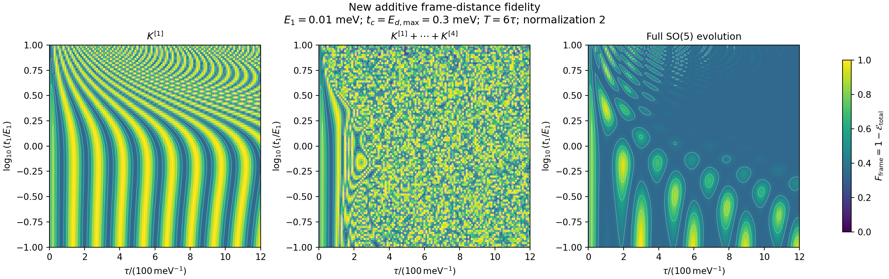
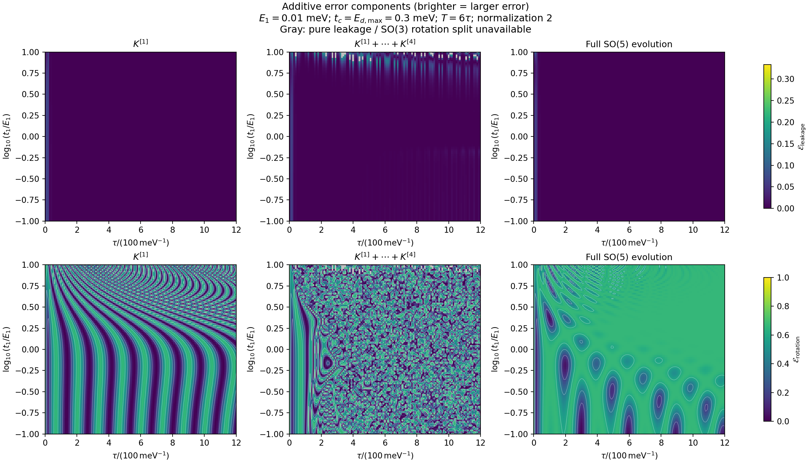
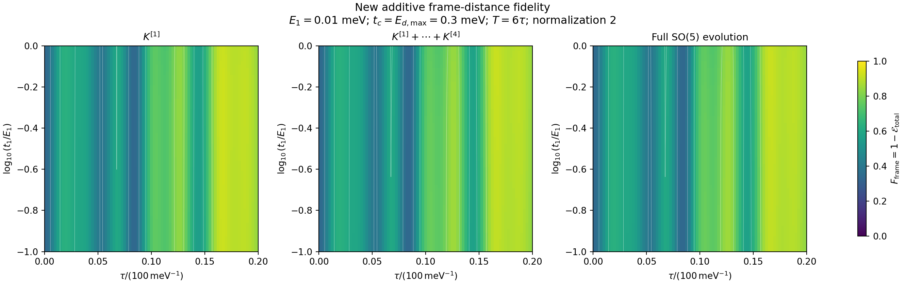

# 用可加的标架距离研究泄漏、旋转与高阶参数响应

本文采用新的总误差定义，研究 $E=E_1$、$g=t_1$ 的高阶项怎样分别影响子空间泄漏代价和内部旋转代价，并与完整 $SO(5)$ 演化对照。模型、脉冲和理想双编织目标保持不变。本文不把总误差的两部分解释成独立随机事件，也不使用单粒子态重叠作为评价指标。

## 1. 模型、终点和参数

按 $(\gamma_1,\gamma_2,\gamma_3,\gamma_a,\gamma_b)$ 排序，

$$
\dot R=\Omega(t;E,g)R,\qquad R(0)=I_5,\qquad
\Omega=\Omega_0+E\Omega_E+g\Omega_g,
$$

$$
\Omega=2\begin{pmatrix}
0&E&0&0&gf\\
-E&0&0&-t_2&0\\
0&0&0&t_3&0\\
0&t_2&-t_3&0&E_d\\
-gf&0&0&-E_d&0
\end{pmatrix}.
$$

取 $\hbar=1$，能量单位为 meV，时间单位为 $\mathrm{meV}^{-1}$。保留 SO(5) 的归一化因子 $2$。每段时长 $\tau$，段内时间 $s\in[0,1]$，记 $f_\pm=(1\pm\cos\pi s)/2$：

| 段 | $t_2$ | $t_3$ | $E_d$ | $f$ |
|---|---|---|---|---|
| 1 | $0.3f_-$ | $0$ | $0.3f_+$ | $f_-$ |
| 2 | $0.3f_+$ | $0.3f_-$ | $0$ | $f_+$ |
| 3 | $0$ | $0.3f_+$ | $0.3f_-$ | $0$ |

三段重复两次，终点 $T=6\tau$。理想双编织为

$$
B=B_{23}^2=\operatorname{diag}(1,-1,-1).
$$

只比较前三个初始 Majorana 方向的完整演化结果：

$$
W=R(T)\begin{pmatrix}I_3\\0\end{pmatrix}
=\begin{pmatrix}M\\N\end{pmatrix},\qquad
W_B=\begin{pmatrix}B\\0\end{pmatrix}.
$$

$W$ 是五维空间内的正交三标架，满足 $M^TM+N^TN=I_3$。理想结果不限制量子点内部的最终旋转。

## 2. 严格分成“先泄漏、后旋转”

在 $M$ 可逆且 $\det M>0$ 的分支上，使用右极分解

$$
M=US,\qquad S=(M^TM)^{1/2}=(I_3-N^TN)^{1/2}>0,\qquad U\in SO(3).
$$

它与 n6.md 中的左极分解 $M=HU$ 使用同一个 $U$，但 $S=U^THU$，不能混用乘法顺序。

终点标架有精确分解：

$$
\boxed{
W=\begin{pmatrix}U&0\\0&I_2\end{pmatrix}
\begin{pmatrix}S\\N\end{pmatrix}.
}
$$

第一步把有效子空间转向辅助方向，保留下来的块 $S$ 是正定收缩，不包含正交旋转。第二步只旋转有效子空间，保持 $N$ 和泄漏量不变。

第一步也能补全为一个明确的 $SO(5)$ 矩阵。令 $J=(I_2-NN^T)^{1/2}$，则

$$
\mathcal L_N=
\begin{pmatrix}S&-N^T\\N&J\end{pmatrix}\in SO(5).
$$

由 $SN^T=N^TJ$ 可验证 $\mathcal L_N^T\mathcal L_N=I_5$；把 $N$ 连续缩放到零，可知其行列式为 $+1$。因此

$$
W=\operatorname{diag}(U,I_2)\mathcal L_N
\begin{pmatrix}I_3\\0\end{pmatrix}.
$$

完整 $R$ 与这两个因子的乘积只差右侧一个 $\operatorname{diag}(I_3,V)$，其中 $V\in SO(2)$，它不影响所比较的前三列。

这是终点的等价分解，不意味着原始时间演化真的依次经历两个独立的物理阶段。给定合法的 $N$ 可以自由选择 $U$，但在指定脉冲协议下，$N(E,g)$ 和 $U(E,g)$ 仍由同一动力学共同决定。

## 3. 总误差与精确可加分解

### 3.1 从正交投影的单位分解定义总误差

利用 $I=P+Q$、$PQ=0$，定义

$$
\boxed{
\mathcal E_{\rm total}
=\frac1{12}\|W-W_B\|_F^2
=\frac{\|M-B\|_F^2+\|N\|_F^2}{12}.
}
$$

这是嵌入空间中的平方弦距离，不是群上的测地距离。每个标架列向量长度为一，三个列差的平方和不超过 $12$，故 $0\le\mathcal E_{\rm total}\le1$。它为零当且仅当 $M=B,N=0$。

由于 $M^TM+N^TN=I_3$，

$$
\boxed{\mathcal E_{\rm total}=\frac{3-\operatorname{tr}(B^TM)}6.}
$$

总误差在所有终点上都有定义，包括 $M$ 奇异和 $\det M<0$ 的情形。

### 3.2 两个非负、无重复计数的代价

在第 2 节的正极分解分支上，定义

$$
\boxed{
\mathcal E_{\rm L}
=\frac{\|S-I_3\|_F^2+\|N\|_F^2}{12}
=\frac{3-\operatorname{tr}S}{6},
}
$$

$$
\boxed{
\mathcal E_{\rm R}
=\frac{\|(U-B)S^{1/2}\|_F^2}{12}
=\frac{\operatorname{tr}S-\operatorname{tr}(B^TM)}6.
}
$$

这里 $S^{1/2}=(M^TM)^{1/4}$，不能误写为 $S$。展开平方，利用 $U^TU=B^TB=I_3$，即可严格得到

$$
\boxed{\mathcal E_{\rm total}=\mathcal E_{\rm L}+\mathcal E_{\rm R}.}
$$

两项都非负。$\mathcal E_{\rm L}=0$ 当且仅当 $N=0$；在 $S>0$ 时，$\mathcal E_{\rm R}=0$ 当且仅当 $U=B$。

另一个等价解释是

$$
\mathcal E_{\rm L}
=\min_{V\in SO(3)}\frac1{12}
\left\|W-\begin{pmatrix}V\\0\end{pmatrix}\right\|_F^2,
\qquad
\mathcal E_{\rm R}=\mathcal E_{\rm total}-\mathcal E_{\rm L}.
$$

最优 $V$ 为 $U$。因此第一项是到无泄漏旋转集合的最小代价，第二项是把这个最佳旋转限定为指定目标 $B$ 后增加的代价。这是距离的精确分配，不是两个概率的相加。

旋转代价包含 $S$ 权重，因为它评价实际保留下来的分量。不能同时要求它等于实际标架距离的增量，又与泄漏程度完全无关。

### 3.3 与旧指标的关系及适用边界

若 $\theta_i$ 是两个子空间的主角，则 $S$ 的特征值为 $\cos\theta_i$，

$$
\mathcal E_{\rm L}=\frac16\sum_i(1-\cos\theta_i),\qquad
\varepsilon_{\rm leak,old}=\frac13\sum_i\sin^2\theta_i.
$$

因 $N$ 是 $2\times3$ 矩阵，至少一个主角为零，所以 $\mathcal E_{\rm L}\le1/3$。小泄漏时，$\mathcal E_{\rm L}\simeq\varepsilon_{\rm leak,old}/4$；两者不能直接用同一数值尺度比较。

无泄漏时 $S=I_3$，

$$
\mathcal E_{\rm R}
=\frac{3-\operatorname{tr}(B^TU)}6
=\frac23\varepsilon_{\rm rot,old}.
$$

如果 $\det M<0$，正极分解给出的 $U$ 属于 $O(3)$ 的反射分支。此时 $(3-\sum_i\sigma_i(M))/6$ 仍可计算，但它是到 $O(3)$ 的最小距离，不能继续解释成“纯泄漏后接 SO(3) 旋转”。

严格限定到 $SO(3)$ 时，最大对齐迹改为 $\sigma_1+\sigma_2-\sigma_3$，最小代价因此增加 $\sigma_3/3$；它已包含取向代价，不再是本节的纯泄漏代价。本文不悄悄改变定义：这些点保留总误差，两部分图标灰。$M$ 奇异时，旋转因子不唯一，两部分的光滑展开也不保证成立。

绘图时定义几何评分

$$
F_{\rm frame}=1-\mathcal E_{\rm total}.
$$

它不是论文的态重叠，也不是成功概率。特别是 $T=0$ 时 $M=I_3$，有 $F_{\rm frame}=1/3$；无泄漏时则有

$$
F_{\rm frame}=\frac13+\frac23F_{\rm rot,old}.
$$

因此在泄漏很小的区域，新图与旧旋转图主要相差数值标度，不能期待仅凭改定义就使物理峰位发生大幅变化。

## 4. 如何得到真正的参数高阶项

对固定协议时长 $\tau$，把完整解展开为

$$
R(t;E,g)=\sum_{m,n\ge0}E^mg^nR_{mn}(t).
$$

这里用普通 Taylor 系数，阶乘已包含在系数中。系数满足三角方程组

$$
\dot R_{mn}=\Omega_0R_{mn}
+\Omega_E R_{m-1,n}+\Omega_gR_{m,n-1},
$$

负下标项为零，$R_{00}(0)=I_5$，其余初值为零。这给出显式的参数多项式结构，不需要对一组参数网格做拟合。

令零缺陷有限时间基准为 $R_0=R(T;0,0)$，再定义

$$
\mathscr R=R_0^TR=e^K,\qquad
K=\sum_{j\ge1}K_j,\qquad
K_j=\sum_{m+n=j}E^mg^nK_{mn}.
$$

非交换性包含在 $K_j$ 中；例如在相互作用绘景中

$$
K_1=\int_0^T V(t)\,dt,\qquad
K_2=\frac12\int_{0<v<u<T}[V(u),V(v)]\,du\,dv,
$$

其中 $V=R_0(t)^T(E\Omega_E+g\Omega_g)R_0(t)$。

系数仍来自基准及变分方程的时间积分，本文属于半解析分析。完整数值演化本来就包含任意阶参数响应；截断公式用于解释和近似完整解，不是在给完整解添加遗漏的物理。

## 5. 相对基准的误差：先推导关于 $K$ 的通用公式

本节只评价 $\mathscr R=e^K$ 相对于单位矩阵的误差，不可直接替代实际绘图中 $R$ 相对于 $B$ 的误差。

分块写为

$$
K=\begin{pmatrix}A&-C^T\\C&D\end{pmatrix},
\qquad A=[\boldsymbol a]_\times,\quad D\in\mathfrak{so}(2).
$$

令 $X=(e^K)_{PP}$、$Y=(e^K)_{QP}$。首先，

$$
Y=C+\frac12(CA+DC)
+\frac16(CA^2+DCA+D^2C-CC^TC)+O(\|K\|^4).
$$

因为相对右极因子为 $\sqrt{I-Y^TY}$，

$$
\mathcal E_{\rm L}^{\rm rel}
=\frac{\operatorname{tr}(Y^TY)}{12}
+\frac{\operatorname{tr}[(Y^TY)^2]}{48}
+O(\|K\|^6).
$$

代入 $Y$ 并整理得

$$
\boxed{
\mathcal E_{\rm L}^{\rm rel}
=\frac{\|C\|_F^2}{12}
-\frac{\|DC-CA\|_F^2+\operatorname{tr}[(C^TC)^2]}{144}
+O(\|K\|^6).
}
$$

总误差可以直接从 $X$ 的迹得到：

$$
\mathcal E_{\rm total}^{\rm rel}
=-\frac{\operatorname{tr}(K^2)_{PP}}{12}
-\frac{\operatorname{tr}(K^4)_{PP}}{144}+O(\|K\|^6).
$$

利用

$$
\begin{aligned}
\operatorname{tr}(K^2)_{PP}
&=-2\|\boldsymbol a\|^2-\|C\|_F^2,\\
\operatorname{tr}(K^4)_{PP}
&=2\|\boldsymbol a\|^4+3\|CA\|_F^2
+2\langle CA,DC\rangle_F+\|DC\|_F^2
+\operatorname{tr}[(C^TC)^2],
\end{aligned}
$$

再减去泄漏代价，得到

$$
\boxed{
\mathcal E_{\rm R}^{\rm rel}
=\frac{\|\boldsymbol a\|^2}{6}
-\frac{\|\boldsymbol a\|^4}{72}
-\frac{\|CA\|_F^2}{72}
-\frac{\langle CA,DC\rangle_F}{36}
+O(\|K\|^6).
}
$$

这些公式不要求各块对易。奇数次 $K$ 对上块迹没有贡献，且 $e^{-K}$ 的上块是 $X^T$、具有相同奇异值，因此上述误差在 $K\mapsto-K$ 下为偶函数。这里的六阶余项是对整体 $K$ 的计数；代入 $K_1+K_2+\cdots$ 后，一般仍可出现五阶参数项。

## 6. 二、三、四阶参数贡献分别是什么

按参数总阶数收集，$C_j,A_j,D_j$ 均已经包含对应的参数幂：

$$
\mathcal E_{\rm L}^{[2]}=\frac{\|C_1\|_F^2}{12},
\qquad
\mathcal E_{\rm L}^{[3]}=\frac{\langle C_1,C_2\rangle_F}{6},
$$

$$
\boxed{
\mathcal E_{\rm L}^{[4]}
=\frac{\|C_2\|_F^2+2\langle C_1,C_3\rangle_F}{12}
-\frac{\|D_1C_1-C_1A_1\|_F^2
+\operatorname{tr}[(C_1^TC_1)^2]}{144}.
}
$$

旋转代价为

$$
\mathcal E_{\rm R}^{[2]}=\frac{\|\boldsymbol a_1\|^2}{6},
\qquad
\mathcal E_{\rm R}^{[3]}=\frac{\boldsymbol a_1\cdot\boldsymbol a_2}{3},
$$

$$
\boxed{
\begin{aligned}
\mathcal E_{\rm R}^{[4]}
={}&\frac{\|\boldsymbol a_2\|^2
+2\boldsymbol a_1\cdot\boldsymbol a_3}{6}
-\frac{\|\boldsymbol a_1\|^4}{72}\\
&-\frac{\|C_1A_1\|_F^2}{72}
-\frac{\langle C_1A_1,D_1C_1\rangle_F}{36}.
\end{aligned}
}
$$

因此四阶误差包含三类来源：二阶生成元的平方、一阶与三阶生成元的干涉，以及一阶生成元经指数和极分解产生的几何修正。只计算 $K_2$ 不足以得到完整四阶误差。

### 6.1 当前模型的进一步简化

基准演化不耦合 $\gamma_1$，故一阶生成元具有

$$
D_1=0,\qquad C_1=c_1e_1^T,\qquad(\boldsymbol a_1)_1=0.
$$

于是 $\|C_1A_1\|_F^2=\|C_1\|_F^2\|\boldsymbol a_1\|^2$，且 $\operatorname{tr}[(C_1^TC_1)^2]=\|C_1\|_F^4$：

$$
\boxed{
\mathcal E_{\rm L}^{[4]}
=\frac{\|C_2\|_F^2+2\langle C_1,C_3\rangle_F}{12}
-\frac{\|C_1\|_F^2\|\boldsymbol a_1\|^2+\|C_1\|_F^4}{144},
}
$$

$$
\boxed{
\mathcal E_{\rm R}^{[4]}
=\frac{\|\boldsymbol a_2\|^2+2\boldsymbol a_1\cdot\boldsymbol a_3}{6}
-\frac{\|\boldsymbol a_1\|^4+\|C_1\|_F^2\|\boldsymbol a_1\|^2}{72}.
}
$$

旧旋转指标的泄漏反馈与这里不同：新代价衡量实际保留下来的分量，权重修正使本模型的这项变成负贡献。这不表示泄漏改善了完整编织；总误差中同时存在正的泄漏代价，而且其他四阶项的符号也须计入。

令 $J_5=\operatorname{diag}(-1,1,1,1,1)$，模型满足 $R(-E,-g)=J_5R(E,g)J_5$，而目标与这个反射对称兼容。因此三种标量误差在参数同时反号时不变。在光滑分支内，所有奇数总阶系数为零，四阶参数展开的下一项是六阶；但 $K_3$ 并不为零。

### 6.2 显式的混合项

写 $C_1=EC_{10}+gC_{01}$、$\boldsymbol a_1=E\boldsymbol a_{10}+g\boldsymbol a_{01}$，则

$$
[\mathcal E_{\rm L}^{\rm rel}]_{11}
=\frac{\langle C_{10},C_{01}\rangle_F}{6},
\qquad
[\mathcal E_{\rm R}^{\rm rel}]_{11}
=\frac{\boldsymbol a_{10}\cdot\boldsymbol a_{01}}3.
$$

两种代价一般都包含 $Eg$ 混合响应，可加的误差分解并没有使参数可分离。

为给出四阶 $E^2g^2$ 的具体式子，记

$$
\begin{gathered}
u_C=\|C_{10}\|_F^2,\quad v_C=\langle C_{10},C_{01}\rangle_F,\quad w_C=\|C_{01}\|_F^2,\\
u_A=\|\boldsymbol a_{10}\|^2,\quad v_A=\boldsymbol a_{10}\cdot\boldsymbol a_{01},
\quad w_A=\|\boldsymbol a_{01}\|^2,\\
Q_{22}=u_Cw_A+4v_Cv_A+w_Cu_A,\\
D_{C,22}=\|C_{11}\|_F^2+2\langle C_{20},C_{02}\rangle_F
+2\langle C_{10},C_{12}\rangle_F+2\langle C_{01},C_{21}\rangle_F,\\
D_{A,22}=\|\boldsymbol a_{11}\|^2+2\boldsymbol a_{20}\cdot\boldsymbol a_{02}
+2\boldsymbol a_{10}\cdot\boldsymbol a_{12}
+2\boldsymbol a_{01}\cdot\boldsymbol a_{21}.
\end{gathered}
$$

则对本模型，

$$
\boxed{
[\mathcal E_{\rm L}^{\rm rel}]_{22}
=\frac{D_{C,22}}{12}
-\frac{Q_{22}+2u_Cw_C+4v_C^2}{144},
}
$$

$$
\boxed{
[\mathcal E_{\rm R}^{\rm rel}]_{22}
=\frac{D_{A,22}}6
-\frac{2u_Aw_A+4v_A^2+Q_{22}}{72}.
}
$$

这些是相对基准的响应系数；实际图上的绝对误差须用下一节的公式。

## 7. 相对于理想编织的绝对高阶公式

一般有限时间基准 $R_0$ 本身不是理想双编织，所以不能在绘图时直接使用第 5、6 节的相对误差。

令

$$
e^K=\sum_{d\ge0}X_d,\qquad X_0=I_5,
$$

则

$$
\begin{aligned}
X_1={}&K_1,\\
X_2={}&K_2+\tfrac12K_1^2,\\
X_3={}&K_3+\tfrac12(K_1K_2+K_2K_1)+\tfrac16K_1^3,\\
X_4={}&K_4+\tfrac12(K_1K_3+K_3K_1+K_2^2)\\
&+\tfrac16(K_1^2K_2+K_1K_2K_1+K_2K_1^2)+\tfrac1{24}K_1^4.
\end{aligned}
$$

从 $R_0X_d$ 取出前三列的上、下块，分别记为 $M_d,N_d$。总误差的任意阶系数直接为

$$
\mathcal E_{\rm total}^{[0]}=\frac{3-\operatorname{tr}(B^TM_0)}6,\qquad
\boxed{\mathcal E_{\rm total}^{[d]}=-\frac{\operatorname{tr}(B^TM_d)}6\quad(d\ge1).}
$$

这给出了一个优点：新的总误差不必先展开旋转角或极分解，只需取演化响应系数的线性迹。基准非理想时，$K_4$ 也可进入绝对四阶总误差，不能因相对公式中没有 $K_4$ 而省略它。

为拆分两部分，令 $S=\sum_d S_d$，$G=M^TM=\sum_dG_d$，其中

$$
G_d=\sum_{i=0}^dM_i^TM_{d-i},\qquad S_0=\sqrt{G_0}.
$$

由 $S^2=G$，每一阶满足明确的 Sylvester 方程

$$
\boxed{
S_0S_d+S_dS_0=G_d-\sum_{i=1}^{d-1}S_iS_{d-i}.
}
$$

例如

$$
\begin{aligned}
S_0S_1+S_1S_0&=G_1,\\
S_0S_2+S_2S_0&=G_2-S_1^2,\\
S_0S_3+S_3S_0&=G_3-S_1S_2-S_2S_1,\\
S_0S_4+S_4S_0&=G_4-S_1S_3-S_3S_1-S_2^2.
\end{aligned}
$$

若 $S_0=Q\operatorname{diag}(s_i)Q^T$ 且右侧为 $H_d$，其显式解是

$$
(Q^TS_dQ)_{ij}=\frac{(Q^TH_dQ)_{ij}}{s_i+s_j}.
$$

于是

$$
\mathcal E_{\rm L}^{[0]}=\frac{3-\operatorname{tr}S_0}6,\quad
\boxed{\mathcal E_{\rm L}^{[d]}=-\frac{\operatorname{tr}S_d}6,\qquad
\mathcal E_{\rm R}^{[d]}=\mathcal E_{\rm total}^{[d]}-\mathcal E_{\rm L}^{[d]}.}
$$

二元系数版本只需把上面的阶数卷积改为多重下标卷积，便可得到每个 $E^mg^n$ 的系数。该递推包含 $N_0$ 非零引起的基准干涉，而非把实际基准人为设为理想值。$S_0$ 奇异时，两部分的这个光滑递推不适用，但总误差的迹公式依然成立。

## 8. 如何绘图，怎样判断高阶项是否有用

实际二维图采用

$$
R^{(p)}=R_0\exp\!\left(\sum_{j=1}^pK_j\right),\qquad p=1,2,3,4,
$$

随后对 $R^{(p)}$ 计算第 3 节的精确指标。指数保留保证重建仍处于群上，但它产生的更高次参数项只是重建方式的结果，不等于已经求得全部真实高阶生成元。

图中分别显示：

* $F_{\rm frame}=1-\mathcal E_{\rm total}$，数值越大越接近目标；
* $\mathcal E_{\rm L}$ 和 $\mathcal E_{\rm R}$，数值越大表示代价越大；
* 四阶减一阶的改变量，以及各阶减完整演化的偏差。前者是“变了多少”，后者才是“是否更准确”。

全图固定 $E_1=0.01$ meV，取 $x=\tau/(100\,\mathrm{meV}^{-1})\in[0,12]$、$y=\lg(t_1/E_1)\in[-1,1]$，网格为 $121\times101$。另在相同 $E_1$ 下取 $x\in[0,0.2],y\in[-1,0]$、$81\times61$ 点检查局部适用性。

系数沿用 n6.md 已检验的生成元网格。旧缓存只保存了原指标，无法从那些标量唯一恢复新的加权迹，因此完整演化参考标架重新积分，并保存全部前三列，避免以后只剩标量而无法重新评价。

总误差始终绘制；不满足正极分解分支条件的点，两部分图标灰。灰色不是零误差，也不是数值积分失败。

## 9. 代码与可复现性

* [公式和局部参数验证](ss3/verify_additive_errors.py)
* [二维图和完整演化对照](ss3/plot_additive_error_maps.py)
* [代数、混合系数与两组协议的结果](ss3/additive_error_results/verification.json)
* [全范围数据](ss3/additive_error_maps/maps.npz)、[全范围指标](ss3/additive_error_maps/metrics.npz)、[统计](ss3/additive_error_maps/summary.json)、[精度检查](ss3/additive_error_maps/validation.json)
* [局部范围统计](ss3/additive_error_maps/local/summary.json)

在项目根目录运行：

~~~bash
OPENBLAS_NUM_THREADS=1 PYTHONDONTWRITEBYTECODE=1 \
  .venv/bin/python ss3/verify_additive_errors.py

OPENBLAS_NUM_THREADS=1 MPLCONFIGDIR=/tmp/mpl PYTHONDONTWRITEBYTECODE=1 \
  .venv/bin/python ss3/plot_additive_error_maps.py --validate

OPENBLAS_NUM_THREADS=1 MPLCONFIGDIR=/tmp/mpl PYTHONDONTWRITEBYTECODE=1 \
  .venv/bin/python ss3/plot_additive_error_maps.py \
  --source ss3/error_channel_maps/local/maps.npz \
  --output-dir ss3/additive_error_maps/local --validate
~~~

二维脚本需要 n6.md 对应的生成元缓存；已有本次数据时可用 <code>--render-only</code> 重绘。生成元缓存以 $E_1/0.01$、$t_1/0.01$ 为无量纲变量；验证结果 JSON 中标为 <code>coefficients_physical</code> 的系数已经换算回 meV 的相应负次幂。

指标数组第一维依次为一、二、三、四阶重建以及完整演化，后两维是纵轴和横轴。<code>maps.npz</code> 中的 <code>frames</code> 额外带有 $5\times3$ 标架维度。<code>metrics.npz</code> 中带 <code>raw</code> 的两项也保存了反射分支上的正交对齐值，不能绕过 <code>valid</code> 标记把它们解释成 SO(3) 两过程。

## 10. 公式验证及具体高阶贡献

### 10.1 验证层次

验证脚本分别检查了：

1. 一百组随机合法矩阵的“泄漏后接旋转”分解、正交性及距离恒等式，最大数值残差小于 $10^{-14}$。
2. 一般非对易 $A,C,D$ 及二元生成元级数，直接展开矩阵指数和右极分解，与第 6 节公式比较，系数最大残差约 $1.39\times10^{-17}$。
3. 固定随机 $K$ 后用独立矩阵指数计算真实误差，验证四阶公式的六阶余项。把整体生成元从 $0.2K$ 缩小到 $0.1K$，泄漏余项由 $1.62\times10^{-8}$ 降到 $2.54\times10^{-10}$，旋转余项由 $1.46\times10^{-8}$ 降到 $2.28\times10^{-10}$，均约缩小 $64$ 倍。
4. 当前物理模型的两组协议，分别核对相对误差、绝对误差、显式 $E^2g^2$ 系数，以及重建结果与完整演化的差异。

这些验证分别检验代数恒等式、阶数及物理模型响应，不能用其中某一项代替其余验证。

两组协议的完整绝对误差为：

| $\tau$（$\mathrm{meV}^{-1}$） | $E_1$（meV） | $t_1$（meV） | $\mathcal E_{\rm L}$ | $\mathcal E_{\rm R}$ | $\mathcal E_{\rm total}$ |
|---|---:|---:|---:|---:|---:|
| 100 | 0.0002 | 0.0003 | $5.19025692\times10^{-6}$ | $1.69066968\times10^{-3}$ | $1.69585993\times10^{-3}$ |
| 1 | 0.02 | 0.03 | $0.164798464$ | $0.325843615$ | $0.490642079$ |

### 10.2 一组具体的四阶项拆分

在第一组协议，先剥离有限时间基准，用相对误差检验第 6 节的机制公式。二阶主项分别为

$$
\mathcal E_{\rm L}^{[2]}=1.20030219\times10^{-8},\qquad
\mathcal E_{\rm R}^{[2]}=1.69222265\times10^{-3}.
$$

各四阶来源为：

| 四阶来源 | 泄漏代价贡献 | 旋转代价贡献 |
|---|---:|---:|
| 二阶生成元自身 | $+3.26114818\times10^{-12}$ | $+6.68905498\times10^{-8}$ |
| 一阶与三阶干涉 | $-8.83197046\times10^{-13}$ | $-2.08383765\times10^{-7}$ |
| 泄漏与内部传递配合 | $-1.01558928\times10^{-11}$ | — |
| 有限泄漏转角修正 | $-1.44072536\times10^{-16}$ | — |
| 有限内部转角修正 | — | $-1.43180874\times10^{-6}$ |
| 实际存留分量的权重修正 | — | $-2.03117855\times10^{-11}$ |
| **四阶总和** | **$-7.77808571\times10^{-12}$** | **$-1.57332227\times10^{-6}$** |

本模型 $D_1=0$，表中未另列为零的辅助旋转项。这些是相对误差的四阶贡献，不能直接加到绝对基准上当作绘图结果。

对同一个测试点，使用第 7 节的绝对标量展开，二阶预测的总误差偏差为 $+1.57264\times10^{-6}$，四阶预测的偏差降为 $-7.02724\times10^{-10}$。这支持高阶公式在该局部测试点的作用。

作为区别，保留完整指数的一、二、三、四阶生成元重建，其绝对总误差相对于完整演化的偏差分别为

$$
1.40115\times10^{-7},\quad
2.08054\times10^{-7},\quad
3.89078\times10^{-11},\quad
7.82359\times10^{-11}.
$$

这再次说明，阶数增加不保证每一步都单调改善；标量四阶截断与生成元四阶指数重建也不是同一种近似。

### 10.3 参数混合性没有被可加定义消除

第一组协议的部分物理单位系数为：

| 评价方式 | 单项式 | 泄漏代价系数 | 旋转代价系数 |
|---|---|---:|---:|
| 相对基准 | $Eg$ | $-0.02108171$ | $-14591.15651$ |
| 相对基准 | $E^2g^2$ | $4912.75443$ | $-496267492.47641$ |
| 相对理想编织 | $Eg$ | $0.04493450$ | $-14590.97730$ |
| 相对理想编织 | $E^2g^2$ | $-545.68359$ | $-496245852.85616$ |

$Eg$ 的系数单位是 $\mathrm{meV}^{-2}$，$E^2g^2$ 的系数单位是 $\mathrm{meV}^{-4}$。必须乘上实际参数幂才是误差贡献。每个总误差系数都等于对应两部分系数之和。

可以同时成立的是：$\mathcal E_{\rm total}=\mathcal E_{\rm L}+\mathcal E_{\rm R}$，但 $\mathcal E_{\rm L}(E,g)$、$\mathcal E_{\rm R}(E,g)$ 各自都不是两个单参数响应的简单加和。

## 11. 二维图及适用范围

### 11.1 论文参数范围

下图左、中、右依次为一阶生成元、四阶生成元和完整演化，色标为新定义的 $F_{\rm frame}$：

两部分误差分别绘制如下，上排为泄漏代价，下排为旋转代价；此图颜色越亮表示误差越大：

全范围平均绝对预测偏差为：

| 生成元阶数 | 总误差偏差 | 泄漏代价偏差 | 旋转代价偏差 |
|---|---:|---:|---:|
| 1 | $0.28739$ | $2.06918\times10^{-4}$ | $0.28730$ |
| 2 | $0.29031$ | $9.37825\times10^{-5}$ | $0.29033$ |
| 3 | $0.28237$ | $1.77699\times10^{-4}$ | $0.28210$ |
| 4 | $0.28081$ | $5.26255\times10^{-3}$ | $0.28458$ |

总误差列使用全部 $12221$ 个点；两部分列统一使用所有阶数与完整演化都满足正极分解分支的共同点，占 $99.31\%$。因此不能把表中的三个平均绝对偏差直接相加。

四阶仍未在全图准确逼近完整演化，且泄漏预测明显变差。四阶有 $84$ 个点不满足分步解释，但总误差仍显示；完整演化在这张网格上均处于有效分支。

中列密集纹理来自失准截断的采样，不能认作物理峰线。长时间时各阶生成元不再依次减小，例如 $x=6,y=0$ 的 $\|K_j\|_F$ 约为 $39,171,663,1766$。更换误差定义不能修复这种演化近似失准。

新指标的全图平均偏差约 $0.28$，小于旧旋转指标约 $0.43$，不能据此说动力学更准确；无泄漏时两者本就相差 $2/3$ 的归一化因子。完整演化和生成元系数没有因此改变。

另见[四阶单幅图](ss3/additive_error_maps/fidelity_order4.png)、[高阶改变量图](ss3/additive_error_maps/high_order_change.png)、[近似相对完整演化的偏差图](ss3/additive_error_maps/approximation_error.png)。

### 11.2 局部区域

保持 $E_1=0.01$ meV，缩小到 $x\in[0,0.2]$、$y\in[-1,0]$：

| 生成元阶数 | 总误差偏差 | 泄漏代价偏差 | 旋转代价偏差 |
|---|---:|---:|---:|
| 1 | $6.85046\times10^{-3}$ | $3.83968\times10^{-3}$ | $9.34642\times10^{-3}$ |
| 2 | $1.78583\times10^{-3}$ | $3.67607\times10^{-4}$ | $1.87674\times10^{-3}$ |
| 3 | $1.42026\times10^{-4}$ | $3.79129\times10^{-5}$ | $1.48404\times10^{-4}$ |
| 4 | $1.55044\times10^{-5}$ | $3.69751\times10^{-6}$ | $1.60689\times10^{-5}$ |

总误差使用全部 $4941$ 个点；两部分使用共同有效的 $85.19\%$ 网格点。在这个快速演化区，完整演化本身有 $671$ 个点离开正极分解 SO(3) 分支，因而[局部两部分图](ss3/additive_error_maps/local/error_components.png)中也存在灰色区域；总误差图不受这一分解限制。

局部区域内，高阶项显著改善了对三个指标的预测。这是近似精度改善，不表示实际系统经过了额外控制或获得了更好的物理编织。

## 12. 精度核对与本阶段结论

完整参考使用逐段 DOP853，主容差为 $3\times10^{-12}$、$3\times10^{-14}$。绘图前去除数值正交性漂移；全图原始参考的逐元素正交性最大偏差为 $2.70\times10^{-10}$。

全图与局部图上，直接平方距离和迹公式的最大残差分别为 $8.88\times10^{-16}$、$9.99\times10^{-16}$；有效分支上的非负性和精确加和检查均通过。浮点零附近可能出现 $10^{-16}$ 量级负数，数据未用裁剪来掩盖误差。

将选定九个参考点的积分容差加严至 $10^{-13}$、$10^{-15}$ 后，全图三个指标的最大变化小于 $4.87\times10^{-14}$；局部图小于 $2.18\times10^{-13}$。此外，重新计算最大 $\tau$ 处的高阶系数，而非只重用缓存，四阶总误差的最大抽样变化约为 $9.10\times10^{-7}$，远小于全图 $0.28$ 的平均预测偏差。

这些检查验证了本次数值对照的精度，不是全参数域上的严格截断误差界，也没有证明当前网格解析了失准近似的全部高频纹理。

本阶段得到：

* 新总误差具有明确的标架距离来源，两部分在规定分支内精确相加。
* 高阶影响有具体的二、三、四阶公式，包括 $Eg$、$E^2g^2$ 等混合项；绝对误差可用 Sylvester 递推逐阶计算。
* 高阶公式在局部测试点及局部二维区域有效，长时间全范围的零点生成元截断仍不可靠。
* 本文完成的是新指标的推导及近似验证，尚未用高阶公式可靠追踪全范围峰线，也没有证明新指标应与论文的态重叠图一致。
